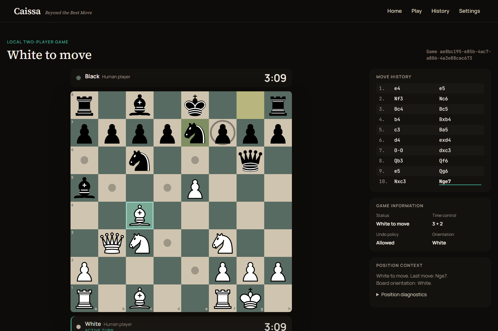
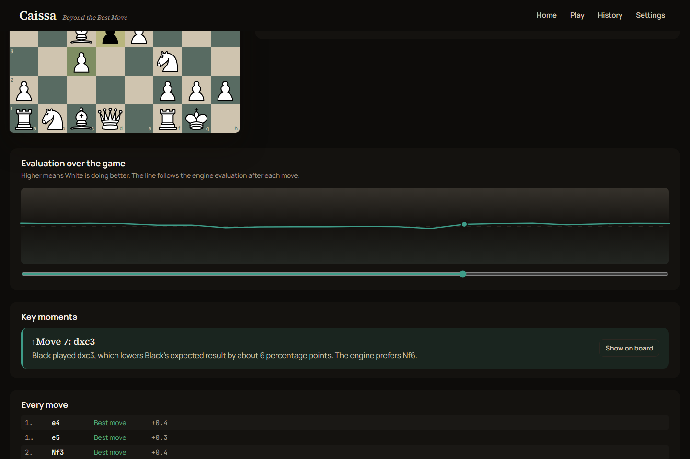

# Caissa

> Beyond the Best Move

Caissa is a browser-first, local-first chess application. You play a bounded, honest engine
opponent, your games are saved in your own browser, and a guided review afterwards shows
you the moments that actually decided the game.

Everything runs on your device. There are no accounts, no servers, and no analytics.

**Play it now:** <https://saminul-amin.github.io/project-caissa/>



### The review is the point

A finished game is replayed through the same bundled engine. You get per-side accuracy, an
evaluation curve, and the handful of moves that actually changed the result — each one
explained by the analysis rather than by a guess about what you meant.




All of this is computed on your device. Nothing is uploaded.

## What Version 1 does

- **Play the engine** at six named strengths, or play a local two-player game.
- **Full legal chess** — castling, en passant, promotion, threefold repetition, the
  fifty-move rule, insufficient material, stalemate, and checkmate.
- **Clocks** with sudden-death and increment time controls, plus untimed play.
- **Takebacks** for practice, pause and resume, restart, and a bounded end-game control.
- **Save and resume** — an interrupted game is restored on your next visit.
- **Game history** stored locally, with PGN export and deletion you control.
- **Guided review** — evaluation curve, per-side accuracy, per-move classification, and the
  key moments that changed the game, all computed locally by the bundled engine.
- **Accessibility** — a keyboard-operable board, live announcements, visible focus, and a
  reduced-motion preference.
- **Offline after first load**, and packaged for itch.io as a self-contained HTML5 upload.

Caissa never claims that a strength name equals a human rating, and never attributes intent
to a move it did not calculate.

## Licence

Caissa is licensed **GPL-3.0-or-later**, because it distributes Stockfish. See `LICENSE`,
`THIRD_PARTY_NOTICES.md`, and `docs/adr/0004-gpl-relicensing.md`.

## Monorepo structure

```text
apps/
  web/                 React, TypeScript, and Vite application
    public/engine/     Vendored single-threaded Stockfish WebAssembly build
  maia-service/        Health-only FastAPI service, unreleased (see ADR-0003)
packages/
  chess-core/          Framework-independent chess domain: rules, clock, lifecycle, results
  shared-contracts/    Runtime-validated API contracts
  design-tokens/       Semantic CSS variables
  test-fixtures/       Curated cross-package fixtures
docs/                  Product and engineering specifications, and ADRs
scripts/               Architecture, secret, artifact, engine, and packaging checks
```

Inside `apps/web/src`:

```text
app/            Composition of routes, providers, and cross-cutting effects
application/    Use cases and ports: game creation, sessions, opponent, review, history
features/       Screens; no persistence, transport, or chess authority
infrastructure/ Adapters: engine, persistence, audio, identity, time, composition
```

Dependencies point inward. `chess-core` imports no framework, screens import no repository,
and the chessboard library exists only behind one adapter file. `pnpm architecture:check`
enforces this.

## Prerequisites

- Node.js 24.12.0
- pnpm 11.11.0 through Corepack
- Python 3.13.x and uv 0.11.8, only for the unreleased service

## Installation

```bash
corepack enable && corepack prepare pnpm@11.11.0 --activate && pnpm install --frozen-lockfile
```

## Development

```bash
pnpm --filter @caissa/web dev
```

The app runs at `http://127.0.0.1:5173`. The engine is fetched on the first opponent turn,
not at page load, so a local two-player game never downloads it.

## Quality commands

```text
pnpm verify               The complete non-E2E quality gate
pnpm build                Build packages and the web application
pnpm test                 TypeScript and Python unit tests with coverage thresholds
pnpm test:e2e             Playwright browser tests
pnpm typecheck            Strict TypeScript across every package
pnpm lint                 ESLint and Ruff
pnpm architecture:check   Import boundaries, layering rules, and cycle rejection
pnpm engine:check         Verify the pinned digests of vendored third-party binaries
pnpm licenses:check       Reject dependencies outside the permissive allowlist
pnpm package:itch         Build and produce the itch.io upload archive
pnpm publish:pages        Verify, build, and push the site to the gh-pages branch
```

Install the browser once before the E2E command:

```bash
pnpm exec playwright install chromium
```

## Publishing to GitHub Pages

The live site at <https://saminul-amin.github.io/project-caissa/> is the production build
served as static files from the `gh-pages` branch. Publishing is a deliberate manual step,
not a GitHub Actions workflow, so it needs no CI minutes and never runs by accident.

```bash
pnpm publish:pages
```

The script refuses to run from a tree with uncommitted changes, runs `pnpm verify`, copies
`apps/web/dist` onto the `gh-pages` branch through a temporary worktree, adds `.nojekyll`,
commits with the source commit recorded in the message, and pushes. Use `--dry-run` to do
everything except the push, and `--skip-verify` to rebuild a tree that has already passed the
gate. The same build works at the domain root, in a subdirectory such as GitHub Pages, and
inside the itch.io iframe, because Vite builds with a relative base and the router uses hash
routes (see `docs/adr/0005-hash-routing-for-static-hosting.md`).

## Releasing to itch.io

```bash
pnpm package:itch
```

This produces `dist-itch/caissa-itch.zip` and `dist-itch/itch-manifest.json`. The script
refuses to write an archive that breaks an itch.io packaging limit, and records the archive
digest in the manifest.

In the itch.io project settings:

- Kind of project: **HTML**
- Upload the archive and tick **This file will be played in the browser**
- Embed: **Click to launch in fullscreen**
- **Do not** enable the SharedArrayBuffer option; the bundled engine is single-threaded and
  works without cross-origin isolation
- Mobile friendly: **on**

## Engine

Caissa bundles Stockfish.js 18.0.8 (`lite-single`), a single-threaded WebAssembly build
that needs SIMD but not `SharedArrayBuffer`. That choice is what lets one build work at a
domain root, in a subdirectory, and inside an itch.io iframe. When a browser lacks the
required capabilities, Caissa says so and offers local two-player play instead of failing
quietly.

See `docs/adr/0002-bundled-stockfish-single-thread.md`.

## Documentation

`docs/` holds the product and engineering specifications; `docs/README.md` is the index and
the conflict-resolution order. Decisions that changed the approved plan are recorded in
`docs/adr/`.
