# Caissa — Architecture Design Document

**Document ID:** CAISSA-ADD-001  
**Document Type:** Architecture Design Document  
**Version:** 1.0  
**Status:** Approved for Implementation Planning  
**Product:** Caissa  
**Product Slogan:** Beyond the Best Move  
**Prepared:** July 2026  
**Owner:** Md. Saminul Amin  
**Primary Audience:** Frontend Engineering, Backend Engineering, AI Engineering, QA, DevOps, Product Design, Technical Reviewers, and Codex-assisted development

---

## 1. Purpose

This document defines the software architecture of Caissa.

It converts the approved product, UX, visual, and technical requirements into an implementation-ready system design covering:

- System boundaries
- Runtime containers
- Frontend modules
- Domain services
- Game state machines
- Chess-engine adapters
- Maia service internals
- Local persistence
- API contracts
- Error propagation
- Concurrency control
- Security boundaries
- Deployment topology
- Dependency rules
- Architectural fitness tests
- Implementation sequence
- Architecture Decision Records

The goal is not to maximize architectural complexity. The goal is to create a system that is:

- Correct
- Recoverable
- Testable
- Replaceable
- Observable
- Accessible
- Efficient
- Clear enough for disciplined Codex-assisted development

---

## 2. Related Documents

This architecture must remain consistent with:

- `00_product_identity.md`
- `01_prd.md`
- `02_ux_specification.md`
- `03_design_system.md`
- `04_technical_specification.md`
- `06_ai_architecture.md` — planned
- `07_testing_strategy.md` — planned
- `08_deployment_and_release.md` — planned
- `09_coding_guidelines.md` — planned

When conflicts occur, use this priority:

1. Chess correctness
2. Security and data integrity
3. Accessibility
4. UX specification
5. Technical specification
6. This architecture document
7. Local implementation convenience

---

# 3. Architecture Executive Summary

Caissa is a browser-first, local-first chess application with optional network-enhanced human-like AI.

The architecture is divided into three runtime zones:

1. **Browser main thread**
   - UI
   - Game orchestration
   - Clock control
   - Local persistence coordination
   - Review presentation

2. **Browser worker layer**
   - Stockfish WebAssembly
   - Search cancellation
   - Engine parsing
   - Capability-dependent engine execution

3. **Remote Maia service**
   - Maia-3 model inference
   - Warm model workers
   - Request validation
   - Candidate probabilities
   - Health and model metadata

The browser always owns the authoritative game state.

Neither Stockfish nor Maia is allowed to mutate game state directly.

The core rule is:

> Engines propose moves. The game controller validates and commits them.

---

# 4. Architecture Goals

## 4.1 Primary Goals

The architecture must:

1. Preserve chess correctness.
2. Keep the active game recoverable.
3. Isolate CPU-intensive work from the UI thread.
4. Allow Stockfish, Maia, and board libraries to be replaced.
5. Support offline local play.
6. Support the itch.io HTML5 environment.
7. Prevent stale async responses from changing current state.
8. Allow deterministic testing of game logic.
9. Make architecture understandable to future contributors.
10. Support incremental delivery without premature backend complexity.

## 4.2 Secondary Goals

The architecture should:

- Support future accounts and cloud synchronization.
- Support custom board rendering later.
- Support additional human-like models later.
- Support future desktop packaging.
- Support future multiplayer without rewriting the local game core.
- Allow telemetry without coupling it to product logic.

## 4.3 Non-Goals for Version 1.0

The initial architecture does not optimize for:

- Real-time online multiplayer
- Distributed tournaments
- Large-scale social features
- Multi-region account services
- Cloud-owned game history
- Collaborative analysis
- Native mobile applications
- Microservice decomposition

---

# 5. Architecture Drivers

The following requirements most strongly shape the design.

## 5.1 Correctness Driver

Chess legality, terminal states, clocks, and PGN must be deterministic and testable.

## 5.2 Resilience Driver

A Maia timeout, Stockfish crash, storage failure, or review error must not invalidate the game.

## 5.3 itch.io Driver

The application must function inside an iframe with relative asset paths and without assuming cross-origin isolation.

## 5.4 Human-Like AI Driver

Maia-3 requires a Python runtime and model process, so it remains outside the browser.

## 5.5 Accessibility Driver

The board implementation must support keyboard and screen-reader behavior, which requires separation between visual board rendering and interaction logic.

## 5.6 Local-First Driver

Game history, settings, active-game snapshots, and PGN should remain available without an account.

## 5.7 Replaceability Driver

External libraries and model runtimes must be isolated behind internal ports.

---

# 6. Architecture Style

Caissa uses a pragmatic layered architecture with hexagonal boundaries around external integrations.

The frontend combines:

- Feature-oriented modules
- Domain services
- Ports and adapters
- Event-driven state transitions
- Local repositories
- Worker-backed compute adapters

The Maia service combines:

- API layer
- Application layer
- Domain validation
- Worker-pool adapter
- Model process supervision
- Infrastructure observability

This is not a strict academic Clean Architecture implementation. It applies the useful rules:

- Domain logic does not import UI libraries.
- UI components do not call IndexedDB directly.
- Game logic does not know whether a move came from Stockfish or Maia.
- API clients do not own product state.
- External libraries are wrapped at module boundaries.
- Side effects are coordinated through application services.

---

# 7. System Context

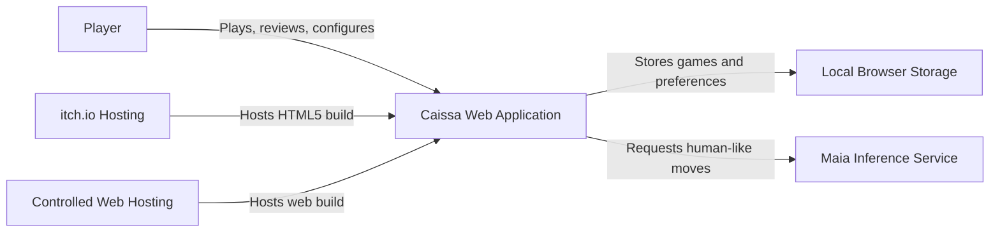

## 7.1 External Actors

### Player

Uses Caissa to:

- Start games
- Make moves
- Choose opponents
- Review games
- Export PGN
- Configure preferences

### itch.io

Hosts the packaged HTML5 build and launches it in an embedded or fullscreen environment.

### Controlled Web Host

Hosts the standard browser build with stronger control over headers, caching, and optional cross-origin isolation.

### Maia Service

Returns human-like move candidates but does not own the game.

---

# 8. Container Architecture

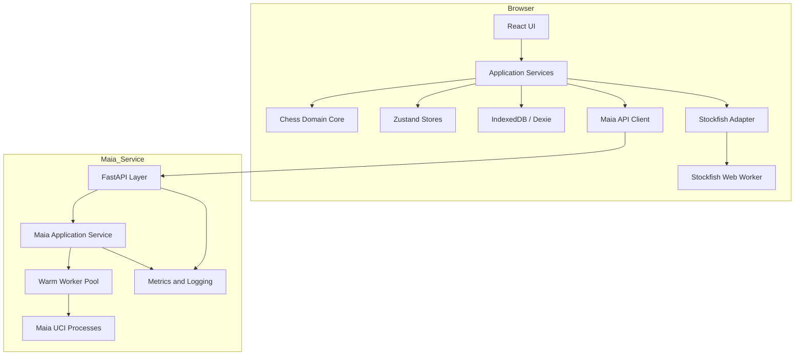

## 8.1 Browser Container

Owns:

- Product experience
- Authoritative game state
- Validation
- Local persistence
- Local engine orchestration
- Remote AI request coordination

## 8.2 Stockfish Worker Container

Owns:

- UCI process lifecycle
- Search execution
- Output parsing
- Cancellation
- Worker-local engine options

Does not own:

- Current game
- Clocks
- Result
- UI state
- Persistence

## 8.3 Maia Service Container

Owns:

- Model availability
- Request validation
- Inference scheduling
- Worker health
- Candidate response formatting

Does not own:

- User account
- Persistent game state
- Browser clock
- Final move commitment

---

# 9. Trust Boundaries

```text
Trusted browser domain
    ├── Product code
    ├── Local storage
    └── Engine worker

Untrusted inputs
    ├── Imported PGN/FEN
    ├── Remote API response
    ├── Browser environment
    ├── Local corrupted records
    └── User-controlled query parameters

Remote trust boundary
    └── Maia service
          ├── Request validation
          ├── Process isolation
          └── Resource controls
```

Rules:

- Every remote move is revalidated locally.
- Every imported position is validated before use.
- Every persisted record is schema-validated before restoration.
- Every engine response is tied to a request ID and expected position.
- No raw user string becomes a UCI command.
- No UI component may trust remote classification text without validation or escaping.

---

# 10. Monorepo Structure

Approved conceptual structure:

```text
caissa/
├── apps/
│   ├── web/
│   │   ├── public/
│   │   ├── src/
│   │   ├── tests/
│   │   ├── vite.config.ts
│   │   └── package.json
│   │
│   └── maia-service/
│       ├── src/
│       ├── tests/
│       ├── Dockerfile
│       ├── pyproject.toml
│       └── README.md
│
├── packages/
│   ├── chess-core/
│   ├── shared-contracts/
│   ├── design-tokens/
│   ├── test-fixtures/
│   └── eslint-config/
│
├── docs/
│   ├── adr/
│   └── diagrams/
│
├── scripts/
│   ├── build-itch/
│   ├── verify-licenses/
│   └── validate-release/
│
├── tooling/
├── LICENSES/
├── THIRD_PARTY_NOTICES.md
├── pnpm-workspace.yaml
├── package.json
└── README.md
```

## 10.1 Package Responsibilities

### `apps/web`

Browser application and UI composition.

### `apps/maia-service`

Python service for human-like inference.

### `packages/chess-core`

Framework-independent TypeScript domain types, game-controller rules, clock rules, result mapping, and PGN utilities.

### `packages/shared-contracts`

JSON-compatible API schemas and generated/static cross-language contract definitions.

### `packages/design-tokens`

Semantic design token definitions used by the web application.

### `packages/test-fixtures`

Curated FEN, PGN, engine output, and scenario fixtures.

---

# 11. Frontend Module Structure

Recommended `apps/web/src` structure:

```text
src/
├── app/
│   ├── App.tsx
│   ├── router/
│   ├── providers/
│   ├── bootstrap/
│   └── error-boundaries/
│
├── features/
│   ├── home/
│   ├── game-setup/
│   ├── play/
│   ├── review/
│   ├── history/
│   ├── settings/
│   └── about/
│
├── domain/
│   ├── game/
│   ├── clock/
│   ├── opponent/
│   ├── review/
│   └── persistence/
│
├── services/
│   ├── game-session/
│   ├── stockfish/
│   ├── maia/
│   ├── audio/
│   ├── telemetry/
│   └── capability/
│
├── infrastructure/
│   ├── db/
│   ├── api/
│   ├── workers/
│   ├── storage/
│   └── logging/
│
├── ui/
│   ├── components/
│   ├── chessboard/
│   ├── layout/
│   ├── feedback/
│   └── icons/
│
├── stores/
├── hooks/
├── lib/
├── styles/
├── types/
└── main.tsx
```

---

# 12. Frontend Dependency Direction

Allowed dependency direction:

```text
app
  ↓
features
  ↓
application services
  ↓
domain
  ↓
ports/interfaces
  ↑
infrastructure adapters
```

UI components may depend on:

- Domain read models
- Application commands
- Design tokens
- Shared UI primitives

UI components may not depend directly on:

- Dexie tables
- Worker implementation
- Raw HTTP client
- Stockfish UCI strings
- Maia subprocess concepts

Domain code may not import:

- React
- Zustand
- Dexie
- Framer Motion
- Tailwind
- Browser APIs
- HTTP libraries

---

# 13. Domain Model

## 13.1 Core Entities

### GameSession

Represents an active or completed game.

Key fields:

```ts
interface GameSession {
  id: GameId;
  phase: GamePhase;
  position: PositionSnapshot;
  history: MoveRecord[];
  players: PlayerPair;
  clocks: ClockPair;
  configuration: GameConfiguration;
  result?: GameResult;
  createdAt: string;
  updatedAt: string;
  schemaVersion: number;
}
```

### PositionSnapshot

```ts
interface PositionSnapshot {
  fen: string;
  sideToMove: Color;
  fullmoveNumber: number;
  halfmoveClock: number;
  inCheck: boolean;
  legalMoveCount: number;
}
```

### MoveRecord

```ts
interface MoveRecord {
  ply: number;
  uci: string;
  san: string;
  fenBefore: string;
  fenAfter: string;
  mover: Color;
  source: MoveSource;
  committedAt: string;
  clockAfter: ClockPair;
}
```

### GameConfiguration

```ts
interface GameConfiguration {
  mode: "ai" | "local";
  playerColor: Color;
  opponent: OpponentConfiguration;
  timeControl: TimeControl;
  allowUndo: boolean;
  boardThemeId: string;
}
```

### GameResult

```ts
interface GameResult {
  outcome: "white-win" | "black-win" | "draw";
  reason:
    | "checkmate"
    | "stalemate"
    | "timeout"
    | "resignation"
    | "repetition"
    | "fifty-move"
    | "insufficient-material"
    | "agreement"
    | "abandonment";
  winner?: Color;
  completedAt: string;
}
```

---

# 14. Value Objects

Use value objects or validated branded types for:

- `GameId`
- `RequestId`
- `Square`
- `Fen`
- `Pgn`
- `UciMove`
- `SanMove`
- `Elo`
- `DurationMs`
- `Ply`
- `EngineVersion`
- `SchemaVersion`

These types reduce accidental misuse.

Conceptual branded type:

```ts
type Fen = string & { readonly __brand: "Fen" };
```

Runtime parsing remains required; compile-time branding alone is insufficient.

---

# 15. Game Controller

## 15.1 Responsibility

The `GameController` is the authoritative application service for active-game transitions.

It coordinates:

- Legal move attempts
- Engine moves
- Clock updates
- Move history
- Results
- Undo
- Restart
- Persistence
- AI request cancellation
- UI read-model updates

## 15.2 Required Commands

```ts
interface GameController {
  createGame(config: GameConfiguration): Promise<GameSession>;
  restoreGame(id: GameId): Promise<GameSession>;
  attemptUserMove(move: MoveAttempt): Promise<MoveCommitResult>;
  commitOpponentMove(proposal: OpponentMoveProposal): Promise<MoveCommitResult>;
  undo(): Promise<void>;
  resign(side: Color): Promise<void>;
  restart(): Promise<void>;
  pause(reason: PauseReason): Promise<void>;
  resume(): Promise<void>;
  abandon(): Promise<void>;
}
```

## 15.3 Commit Rule

All move paths converge on one internal operation:

```text
validate expected phase
    ↓
validate expected position
    ↓
validate legal move
    ↓
update chess.js
    ↓
update clock
    ↓
append move record
    ↓
evaluate terminal state
    ↓
persist snapshot
    ↓
publish read model
    ↓
request opponent move if needed
```

No UI, engine adapter, or API client may bypass this operation.

---

# 16. Game Phase State Machine

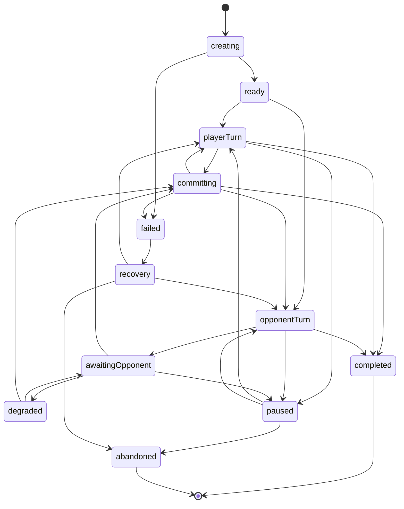

## 16.1 Approved Phases

```ts
type GamePhase =
  | "creating"
  | "ready"
  | "player-turn"
  | "opponent-turn"
  | "awaiting-opponent"
  | "committing"
  | "paused"
  | "degraded"
  | "completed"
  | "abandoned"
  | "recovery"
  | "failed";
```

## 16.2 Phase Invariants

Examples:

- User moves are accepted only in `player-turn`.
- Opponent proposals are accepted only in `awaiting-opponent`.
- Board input is disabled during `committing`.
- Clock is stopped in `completed`, `paused`, and `abandoned`.
- Exactly one side owns the active clock in a live timed game.
- A completed game has a result.
- An incomplete game must not have a terminal result.

---

# 17. Clock Architecture

## 17.1 Clock Service

The clock service uses elapsed monotonic time rather than trusting timer tick frequency.

```ts
interface ClockService {
  start(side: Color, now: MonotonicTime): ClockPair;
  commitMove(side: Color, now: MonotonicTime): ClockPair;
  pause(now: MonotonicTime): ClockPair;
  resume(side: Color, now: MonotonicTime): ClockPair;
  snapshot(now: MonotonicTime): ClockPair;
}
```

## 17.2 Clock State Machine

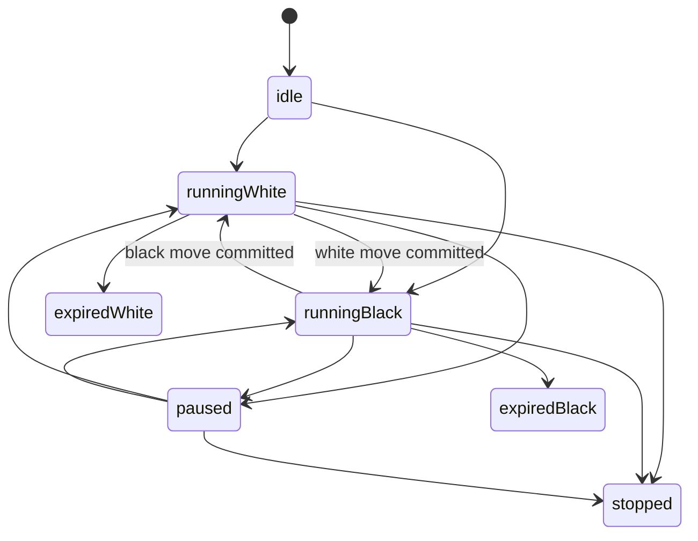

## 17.3 Visibility Changes

On tab visibility change:

- Snapshot elapsed time.
- Persist current clock metadata.
- Recalculate on resume.
- Do not assume background timer callbacks are accurate.

---

# 18. Opponent Architecture

## 18.1 Opponent Port

```ts
interface OpponentProvider {
  readonly kind: "stockfish" | "maia";
  initialize(config: OpponentConfiguration): Promise<void>;
  proposeMove(context: OpponentContext): Promise<OpponentMoveProposal>;
  cancel(requestId: RequestId): Promise<void>;
  getStatus(): OpponentProviderStatus;
  dispose(): Promise<void>;
}
```

## 18.2 Opponent Context

```ts
interface OpponentContext {
  requestId: RequestId;
  gameId: GameId;
  fen: Fen;
  moves: UciMove[];
  sideToMove: Color;
  expectedPly: number;
  timeBudgetMs: number;
  configuration: OpponentConfiguration;
}
```

## 18.3 Move Proposal

```ts
interface OpponentMoveProposal {
  requestId: RequestId;
  expectedFen: Fen;
  expectedPly: number;
  move: UciMove;
  provider: "stockfish" | "maia";
  providerVersion: string;
  candidates?: MoveCandidate[];
  durationMs: number;
  warnings?: string[];
}
```

The game controller rejects a proposal when:

- Request ID is obsolete.
- Expected FEN differs.
- Expected ply differs.
- Move is illegal.
- Game phase changed.
- Game already completed.

---

# 19. Stockfish Adapter Architecture

## 19.1 Components

```text
StockfishOpponentProvider
    ↓
StockfishEngineClient
    ↓
UciCommandQueue
    ↓
WorkerTransport
    ↓
Stockfish Web Worker
```

## 19.2 Responsibilities

### StockfishOpponentProvider

Translates game-level difficulty and time budget into an engine request.

### StockfishEngineClient

Exposes typed operations:

- initialize
- ready
- analyze
- bestMove
- stop
- setOptions
- reset
- dispose

### UciCommandQueue

Ensures UCI commands are serialized correctly.

### WorkerTransport

Owns `postMessage`, worker events, crash detection, and recreation.

### Worker Parser

Parses:

- `uciok`
- `readyok`
- `info`
- `bestmove`
- engine identification
- option declarations

## 19.3 Worker Message Contract

```ts
type StockfishWorkerCommand =
  | { type: "initialize"; requestId: string; options: EngineOptions }
  | { type: "search"; requestId: string; fen: string; moves: string[]; limit: SearchLimit }
  | { type: "stop"; requestId: string }
  | { type: "dispose" };

type StockfishWorkerEvent =
  | { type: "ready" }
  | { type: "info"; requestId: string; payload: EngineInfo }
  | { type: "bestmove"; requestId: string; move: string; ponder?: string }
  | { type: "error"; requestId?: string; code: string; message: string };
```

## 19.4 Worker Recovery

On crash:

1. Mark provider unavailable.
2. Reject active request with typed error.
3. Terminate old worker.
4. Create a fresh worker.
5. Reapply approved options.
6. Run readiness handshake.
7. Permit retry.

The game session remains untouched.

---

# 20. Maia Client Architecture

## 20.1 Browser Components

```text
MaiaOpponentProvider
    ↓
MaiaApiClient
    ↓
HTTP Transport
    ↓
Remote Maia Service
```

## 20.2 Responsibilities

### MaiaOpponentProvider

- Creates request context.
- Applies opponent profile.
- Handles one safe retry.
- Maps service response into `OpponentMoveProposal`.
- Applies fallback policy.

### MaiaApiClient

- Validates outgoing request.
- Sends request with AbortController.
- Validates response with Zod.
- Maps HTTP failures to typed errors.
- Does not mutate game state.

## 20.3 Request Identity

Every Maia request contains:

- Client request ID
- Game ID
- Expected FEN
- Expected ply

Only the client request ID needs to cross the public API if privacy requires avoiding game identifiers.

---

# 21. Maia Service Architecture

Recommended structure:

```text
apps/maia-service/src/
├── main.py
├── api/
│   ├── routes/
│   ├── dependencies.py
│   ├── errors.py
│   └── middleware.py
├── application/
│   ├── move_service.py
│   ├── candidate_service.py
│   └── model_registry.py
├── domain/
│   ├── requests.py
│   ├── responses.py
│   ├── validation.py
│   └── errors.py
├── infrastructure/
│   ├── maia/
│   │   ├── worker_pool.py
│   │   ├── uci_process.py
│   │   ├── parser.py
│   │   └── model_cache.py
│   ├── observability/
│   ├── rate_limit/
│   └── config/
└── tests/
```

## 21.1 API Layer

Responsibilities:

- Parse HTTP request
- Assign/carry request ID
- Authenticate later if required
- Apply body-size limit
- Return stable error schema
- No model logic

## 21.2 Application Layer

Responsibilities:

- Validate use case
- Select model
- Acquire worker
- Enforce timeout
- Build response
- Record metrics
- Release worker

## 21.3 Domain Layer

Responsibilities:

- Validate FEN and move history
- Validate Elo range
- Validate candidate count
- Validate sampling profile
- Define service errors

## 21.4 Infrastructure Layer

Responsibilities:

- Model process
- UCI protocol
- Worker pool
- Model cache
- Logging
- Metrics
- Rate limiting

---

# 22. Maia Worker Pool

## 22.1 Pool Model

A fixed-size pool keeps model processes warm.

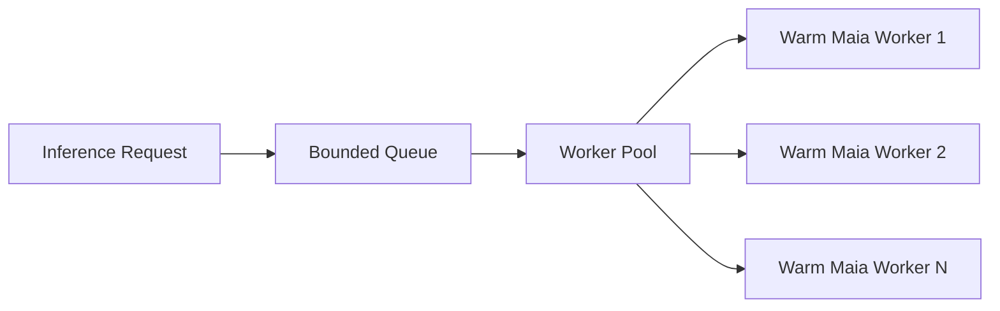

## 22.2 Worker States

```text
starting
ready
busy
unhealthy
restarting
stopped
```

## 22.3 Pool Rules

- Queue is bounded.
- One request per worker at a time unless official runtime proves safe concurrency.
- Request acquisition has a timeout.
- Model startup is not performed inside a normal request.
- An unhealthy worker is removed before reuse.
- Worker replacement is supervised.
- Service readiness requires at least one ready worker.

## 22.4 Worker Interface

```python
class MaiaWorker(Protocol):
    async def infer_move(self, request: MaiaInferenceRequest) -> MaiaInferenceResult: ...
    async def health_check(self) -> bool: ...
    async def restart(self) -> None: ...
    async def close(self) -> None: ...
```

## 22.5 Queue Overload

When capacity is exhausted:

- Return `503 MAIA_BUSY` or approved equivalent.
- Include `retryable: true`.
- Do not accept unbounded work.
- Record queue saturation metrics.

---

# 23. Persistence Architecture

## 23.1 Persistence Port

```ts
interface GameRepository {
  saveActive(session: GameSession): Promise<void>;
  getActive(): Promise<GameSession | null>;
  clearActive(): Promise<void>;
  saveCompleted(session: CompletedGameSession): Promise<void>;
  getById(id: GameId): Promise<SavedGame | null>;
  list(query: GameHistoryQuery): Promise<SavedGameSummary[]>;
  delete(id: GameId): Promise<void>;
}
```

Additional repositories:

```ts
interface PreferencesRepository { /* ... */ }
interface ReviewRepository { /* ... */ }
interface AnalysisCacheRepository { /* ... */ }
```

## 23.2 Dexie Adapter

The Dexie implementation owns:

- Table definitions
- Transactions
- Schema upgrades
- Query optimization
- Serialization
- Validation on read

## 23.3 Transaction Boundary

A move commit should persist:

- Updated active game
- Move record
- Clock snapshot
- Result when terminal

as one logical transaction where possible.

## 23.4 Persistence Failure

If a move is legally committed but persistence fails:

- Keep the valid in-memory game.
- Mark persistence as degraded.
- Retry safely.
- Offer PGN export.
- Do not roll back a move solely because IndexedDB failed.

---

# 24. Local Database Schema

Conceptual Dexie schema:

```ts
interface CaissaDatabaseSchema {
  games: SavedGameRecord;
  activeGames: ActiveGameRecord;
  reviews: ReviewRecord;
  analysisCache: AnalysisCacheRecord;
  metadata: MetadataRecord;
}
```

Suggested indexes:

```text
games:
  id
  createdAt
  updatedAt
  result.outcome
  opponent.kind
  reviewStatus

activeGames:
  id
  updatedAt

reviews:
  gameId
  createdAt
  reviewVersion

analysisCache:
  key
  engineVersion
  accessedAt
```

Only one active game is expected initially, but schema should not make multiple records impossible.

---

# 25. Store Architecture

## 25.1 Store Separation

Recommended Zustand stores:

```text
useGameStore
useEngineStore
usePreferencesStore
useUiStore
useReviewStore
useCapabilityStore
```

## 25.2 Store Responsibilities

### Game Store

Read model for the active game.

It does not contain chess.js instances.

### Engine Store

Provider status, active request, capability mode, and non-authoritative progress.

### Preferences Store

Current preference values mirrored from persistence.

### UI Store

Drawers, dialogs, selected panel, and transient global UI.

### Review Store

Current review navigation and exploration state.

### Capability Store

Detected browser and hosting capabilities.

## 25.3 Store Rule

Stores expose state and commands but may delegate complex actions to services.

Do not embed HTTP, Dexie transactions, or UCI parsing directly in store definitions.

---

# 26. Read Models

Domain entities should be transformed into UI-specific read models.

Example:

```ts
interface ActiveGameViewModel {
  boardFen: string;
  boardOrientation: Color;
  canMove: boolean;
  legalTargets: Record<Square, Square[]>;
  selectedSquare?: Square;
  lastMove?: MoveDisplay;
  checkSquare?: Square;
  topPlayer: PlayerPanelModel;
  bottomPlayer: PlayerPanelModel;
  moveRows: MoveRowModel[];
  phaseLabel: string;
  primaryActions: GameActionModel[];
}
```

Benefits:

- UI does not derive business rules repeatedly.
- Mobile and desktop consume consistent state.
- Accessibility labels can be generated centrally.
- Tests become simpler.

---

# 27. Event Model

The game-session service may publish internal events.

Examples:

```ts
type GameEvent =
  | { type: "game.created"; gameId: GameId }
  | { type: "move.committed"; gameId: GameId; move: MoveRecord }
  | { type: "opponent.requested"; requestId: RequestId }
  | { type: "opponent.failed"; requestId: RequestId; error: AppError }
  | { type: "game.completed"; gameId: GameId; result: GameResult }
  | { type: "persistence.degraded"; gameId: GameId };
```

Internal events may support:

- Persistence
- Audio
- Telemetry
- UI notifications
- Review scheduling

The initial implementation may use a typed in-process event bus or explicit orchestration. It must not introduce a complex event framework unnecessarily.

---

# 28. Application Bootstrap

Boot sequence:

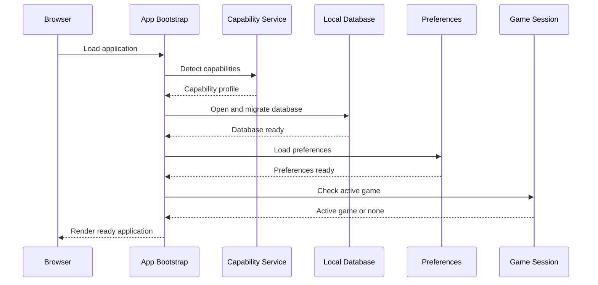

## 28.1 Bootstrap Failure Levels

### Fatal

- Application bundle cannot execute
- Database migration destroys safe access and no recovery exists
- Baseline browser capability missing

### Recoverable

- Stockfish unavailable
- Maia unavailable
- Audio unavailable
- Analytics unavailable
- Review cache corrupted

Recoverable failures must not block the app shell.

---

# 29. Start Game Sequence

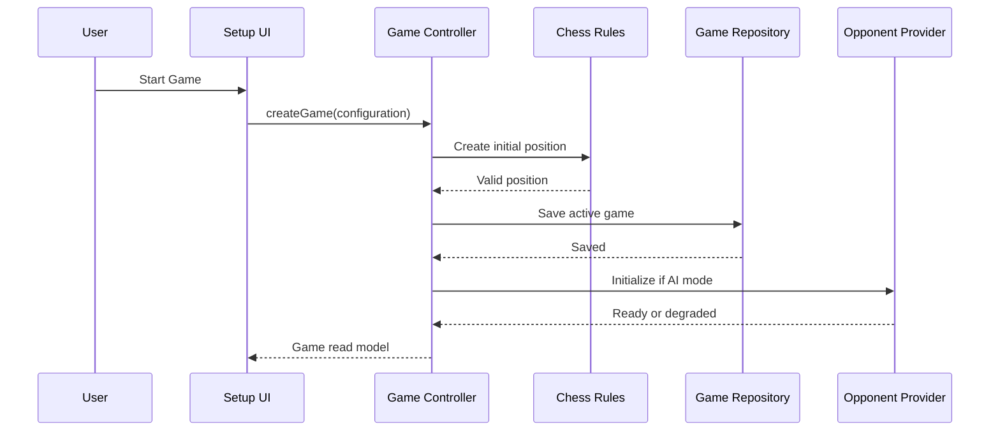

If the AI plays first, the game controller moves directly into `awaiting-opponent`.

---

# 30. User Move Sequence

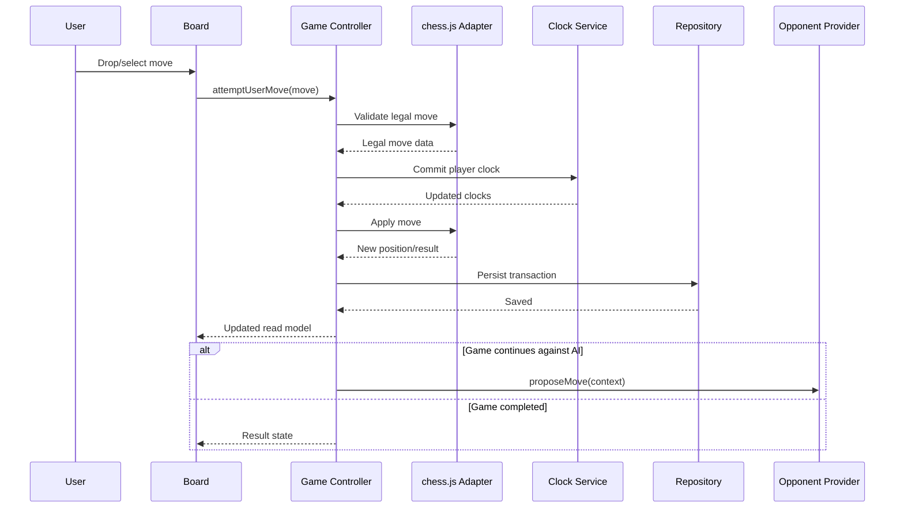

---

# 31. Maia Move Sequence

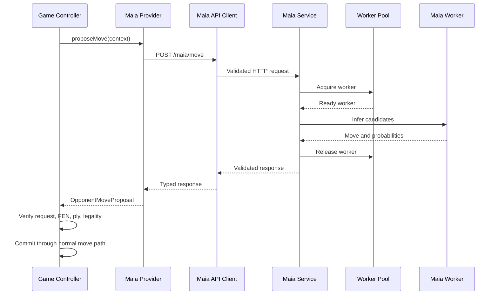

---

# 32. Maia Failure and Fallback Sequence

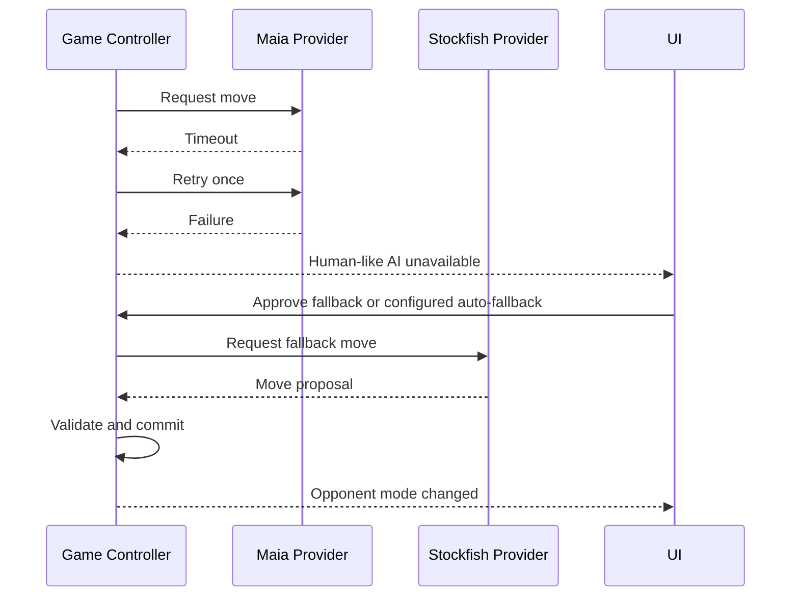

Fallback must be disclosed.

---

# 33. Restore Game Sequence

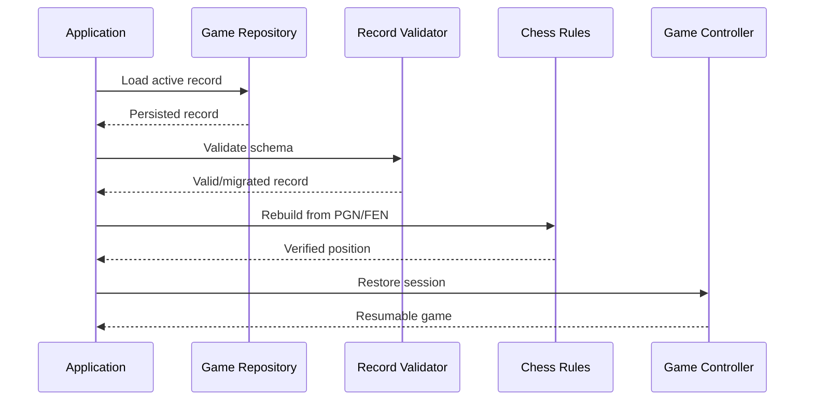

If rich metadata fails but PGN is valid, enter recovery mode rather than discarding the game.

---

# 34. Undo Sequence

For AI games, undo normally reverts the AI reply and the player's previous move.

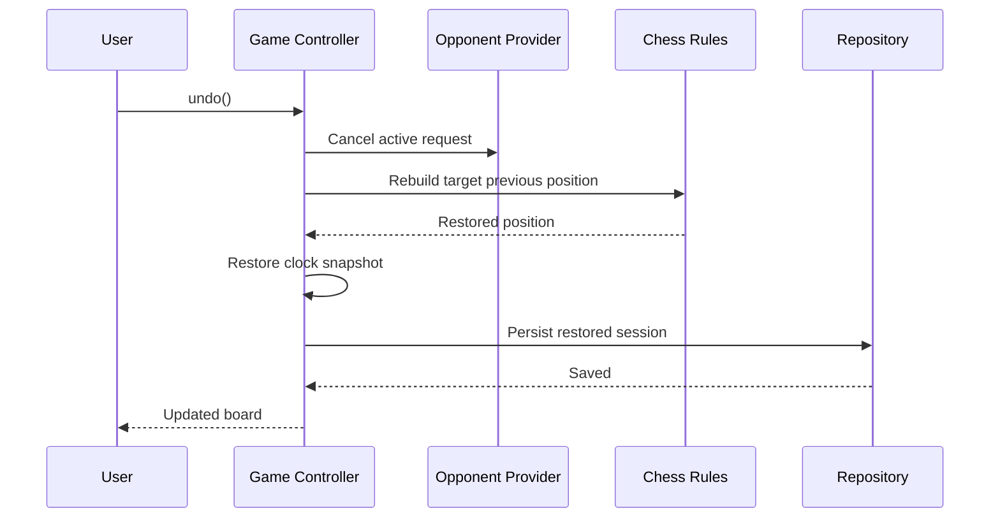

Undo must invalidate analysis derived from removed moves.

---

# 35. Game Completion and Review Sequence

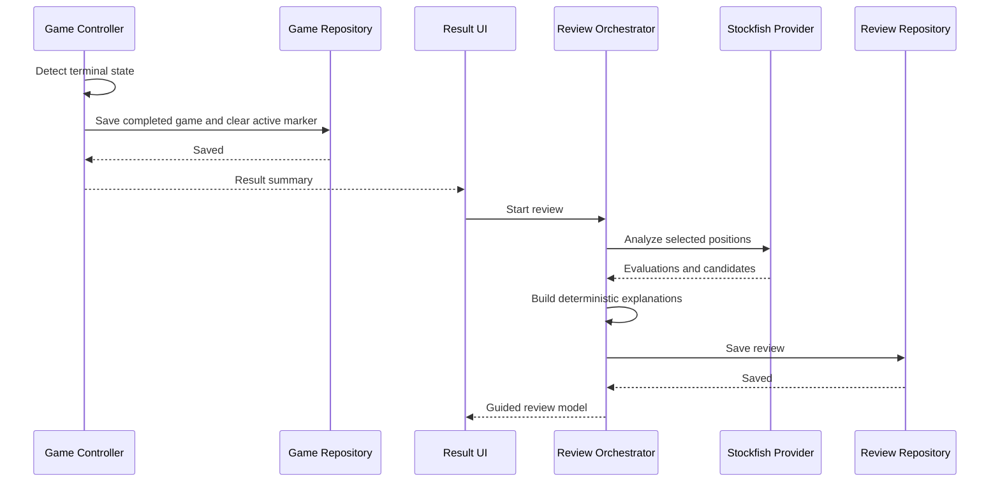

Review generation may be progressive.

---

# 36. Review Architecture

## 36.1 Components

```text
ReviewOrchestrator
    ├── PositionSelector
    ├── StockfishAnalysisProvider
    ├── MoveClassifier
    ├── MotifDetector
    ├── ExplanationComposer
    └── ReviewRepository
```

## 36.2 Position Selector

Selects positions worth analyzing based on:

- Evaluation swing
- Tactical events
- Material change
- Check sequence
- Human-likelihood change
- Endgame transition
- User instructional value

## 36.3 Move Classifier

Consumes evidence and returns a classification with confidence.

It must not classify from a single raw centipawn threshold only.

## 36.4 Explanation Composer

Version 1 uses deterministic templates and structured facts.

It must never invent a legal line.

## 36.5 Review Versioning

A review record includes:

- Review schema version
- Stockfish version
- Analysis profile
- Explanation rules version
- Maia model version when used

This permits later regeneration.

---

# 37. Review State Machine

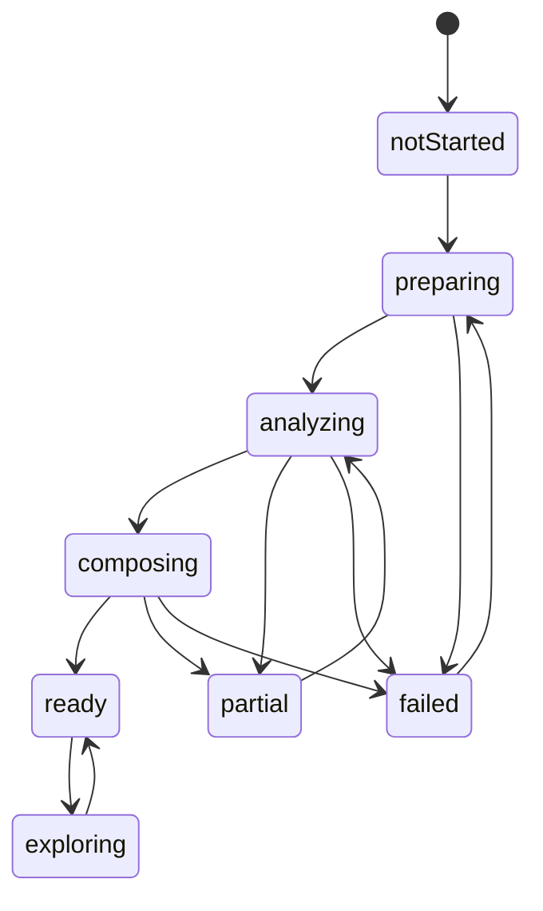

A partial review should remain useful.

---

# 38. API Contract Ownership

The source of truth for public request and response schemas resides in `packages/shared-contracts` conceptually.

Because TypeScript and Python cannot directly share runtime code, contracts must be synchronized through one of:

1. JSON Schema
2. OpenAPI generation
3. Explicit mirrored schemas with contract tests

Approved initial direction:

- FastAPI publishes OpenAPI.
- TypeScript client types may be generated or checked from OpenAPI.
- Zod validates runtime responses.
- Contract tests ensure example requests remain compatible.

---

# 39. Error Architecture

## 39.1 Application Error

```ts
interface AppError {
  code: AppErrorCode;
  category:
    | "user-input"
    | "chess-state"
    | "engine"
    | "network"
    | "storage"
    | "migration"
    | "unsupported"
    | "internal";
  message: string;
  retryable: boolean;
  userMessageKey: string;
  cause?: unknown;
  context?: Record<string, unknown>;
}
```

## 39.2 Error Flow

```text
Infrastructure error
    ↓
Adapter maps to typed error
    ↓
Application service decides recovery
    ↓
Store/read model exposes safe state
    ↓
UI displays human copy
    ↓
Observability receives sanitized details
```

UI components must not interpret raw exceptions.

## 39.3 Error Isolation

Separate error boundaries for:

- App shell
- Gameplay workspace
- Review workspace
- Charts
- Non-critical panels

---

# 40. Capability Detection Architecture

A `CapabilityService` creates one immutable profile at startup.

```ts
interface CapabilityProfile {
  wasm: boolean;
  workers: boolean;
  sharedArrayBuffer: boolean;
  crossOriginIsolated: boolean;
  indexedDb: boolean;
  audio: boolean;
  fullscreen: boolean;
  wakeLock: boolean;
  hardwareConcurrency?: number;
  deviceMemoryGb?: number;
  hostMode: "itch" | "web" | "unknown";
}
```

Derived engine mode:

```ts
type StockfishRuntimeMode =
  | "threaded"
  | "single-thread"
  | "unavailable";
```

Host detection must be advisory, not security-sensitive.

---

# 41. Audio Architecture

```text
Game Event
    ↓
AudioCoordinator
    ↓
Sound Preference
    ↓
Howler Adapter
```

The audio coordinator maps domain events to sounds.

Domain logic must not import Howler.

Example:

```text
move.committed + capture=false → move sound
move.committed + capture=true  → capture sound
game.completed + win           → win sound
```

---

# 42. Telemetry Architecture

Telemetry is optional and disabled unless policy approves it.

```text
Application Event
    ↓
Telemetry Port
    ├── NoOp Adapter
    └── Approved Analytics Adapter
```

Rules:

- Product logic calls semantic events.
- No raw provider API appears in features.
- No full PGN is sent by default.
- Telemetry failure is ignored safely.
- Telemetry is not part of transaction success.

---

# 43. Security Architecture

## 43.1 Browser Controls

- Content Security Policy on controlled hosting
- Strict escaping
- No raw HTML rendering
- Validated imports
- Relative asset paths for itch.io
- No secrets in frontend
- Dependency auditing
- Restricted API origins

## 43.2 Maia Service Controls

```text
Internet
  ↓
TLS / hosting edge
  ↓
CORS allowlist
  ↓
Rate limit
  ↓
Body limit
  ↓
Schema validation
  ↓
Application timeout
  ↓
Bounded queue
  ↓
Isolated worker
```

## 43.3 Subprocess Safety

- Executable path is configuration-controlled.
- Model name is allowlisted.
- UCI commands are created internally.
- No shell interpolation.
- Subprocess stdout is parsed defensively.
- Process resources are constrained.

---

# 44. Deployment Topology

## 44.1 itch.io Deployment

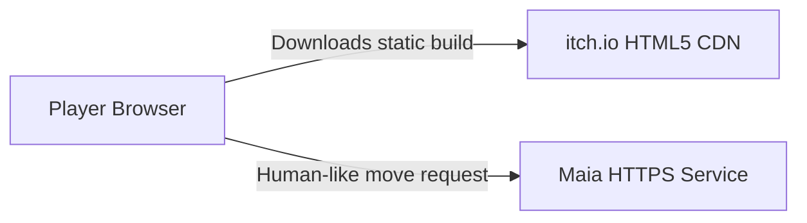

Characteristics:

- Static relative-path bundle
- Single-thread Stockfish fallback
- External Maia API over HTTPS
- Local browser persistence

## 44.2 Controlled Web Deployment

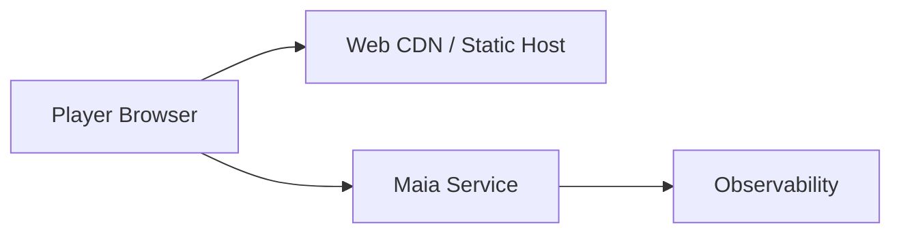

Controlled hosting may enable cross-origin isolation for threaded Stockfish.

## 44.3 Maia Service Deployment

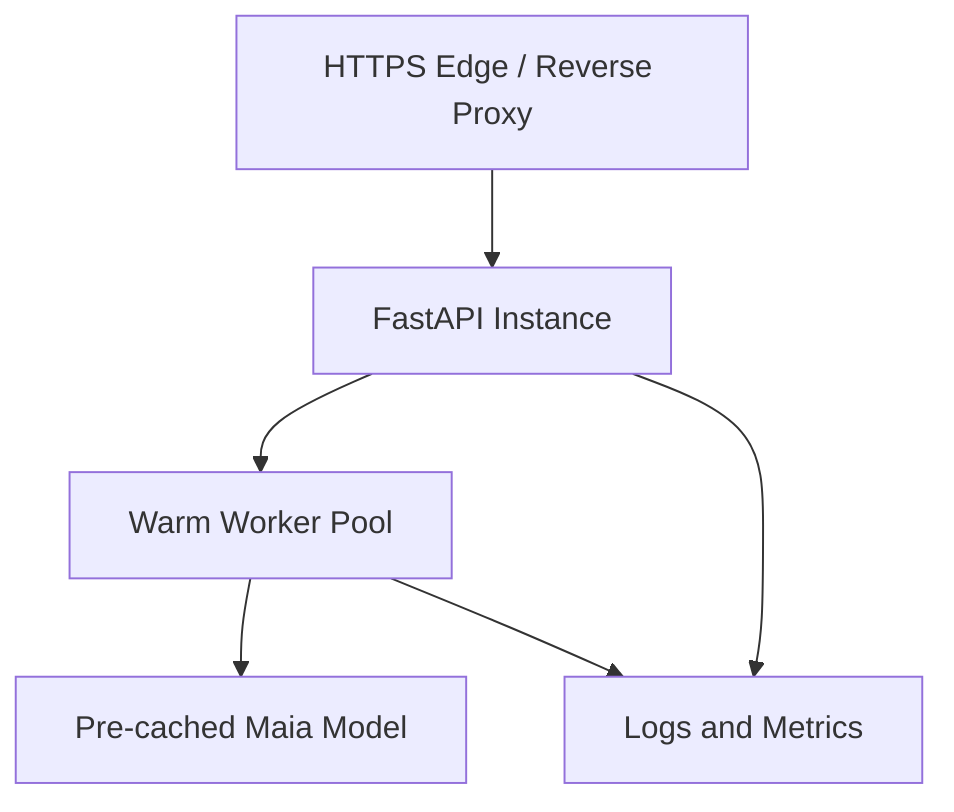

A single service instance is sufficient initially.

---

# 45. Architectural Dependency Rules

## 45.1 Mandatory Rules

1. `domain` imports no UI or infrastructure code.
2. Feature components do not import Dexie.
3. Feature components do not import raw API transport.
4. Only Stockfish infrastructure code knows UCI strings.
5. Only Maia infrastructure code knows HTTP endpoints.
6. Only persistence adapters know database table names.
7. Game state is mutated only through the game controller.
8. Engine moves are always revalidated.
9. Stores do not become general service locators.
10. Cross-feature imports must use public module entry points.

## 45.2 Feature Public API

Each feature should expose a limited index:

```text
features/play/index.ts
```

Internal files must not be imported from unrelated features.

## 45.3 Circular Dependencies

Circular dependencies are prohibited.

Automated checks should enforce this.

---

# 46. Architectural Fitness Functions

Automated architecture tests should verify:

- Domain package has no React dependency.
- UI has no direct Dexie imports.
- No raw `fetch` outside approved HTTP adapter.
- No `new Worker` outside worker infrastructure.
- No literal engine command outside Stockfish adapter.
- No direct `localStorage` outside preference adapter.
- Bundle budget remains within threshold.
- Dependency graph has no cycles.
- Public API schemas remain compatible.
- Every state-machine transition is covered by tests.
- Every persisted schema has migration coverage.

Possible tools:

- ESLint restricted imports
- dependency-cruiser
- Madge
- custom repository scripts
- TypeScript project references

---

# 47. Architecture Decision Records

Architecture decisions must be recorded in:

```text
docs/adr/
```

Naming:

```text
0001-browser-first-local-core.md
0002-maia-remote-service.md
0003-stockfish-web-worker.md
...
```

Each ADR contains:

- Context
- Decision
- Alternatives
- Consequences
- Status
- Date

---

# 48. Initial ADR Set

## ADR-0001 — Browser-First Local Core

**Decision:** Core gameplay runs without a backend.

**Reason:** Reliability, itch.io compatibility, privacy, and offline use.

## ADR-0002 — Remote Maia Service

**Decision:** Maia-3 runs in Python behind FastAPI.

**Reason:** Official runtime, model size, browser complexity, and operational control.

## ADR-0003 — Stockfish in Web Worker

**Decision:** Stockfish never runs on the main thread.

**Reason:** UI responsiveness and lifecycle isolation.

## ADR-0004 — Single-Thread itch.io Fallback

**Decision:** itch.io does not require cross-origin-isolated threaded Stockfish.

**Reason:** Embedded hosting headers are outside product control.

## ADR-0005 — chess.js as Browser Rules Authority

**Decision:** All browser move legality is centralized through chess.js.

**Reason:** Mature rules implementation and avoidance of duplicate legality logic.

## ADR-0006 — Dexie over Direct IndexedDB

**Decision:** Structured persistence uses Dexie.

**Reason:** Transactions, migrations, and maintainability.

## ADR-0007 — Board Adapter Boundary

**Decision:** `react-chessboard` is wrapped.

**Reason:** Accessibility and custom rendering may require replacement.

## ADR-0008 — Deterministic Explanations First

**Decision:** Version 1 review explanations are template-based.

**Reason:** Testability, cost, accuracy, and reduced hallucination risk.

---

# 49. Anti-Patterns

The following are prohibited.

## 49.1 God Store

One Zustand store containing all UI, game, engine, persistence, and review logic.

## 49.2 Smart Board Component

A chessboard component that decides legality, requests AI moves, updates clocks, and persists data.

## 49.3 Engine-Coupled Game State

Storing the Stockfish or Maia object as the game source of truth.

## 49.4 Raw Async Mutation

Committing whichever AI response arrives last without checking request identity and expected position.

## 49.5 Direct Database UI Calls

Calling Dexie from React views.

## 49.6 Silent Fallback

Replacing Maia with Stockfish or a random move without disclosure.

## 49.7 Backend-Owned Browser Game

Requiring server confirmation for legal local moves in an AI practice game.

## 49.8 Premature Microservices

Separating review, model registry, and health into independent deployed services before scale requires it.

## 49.9 Architecture by Folder Name Only

Creating `domain`, `services`, and `infrastructure` directories while allowing unrestricted imports.

---

# 50. Implementation Sequence

## Phase 1 — Architecture Skeleton

- Create monorepo
- Configure TypeScript strict mode
- Configure Python service
- Establish shared contracts
- Add architecture lint rules
- Create empty adapters and ports

## Phase 2 — Chess Core

- Game domain types
- chess.js adapter
- Game controller
- Clock service
- Result mapping
- Fixtures and regression tests

## Phase 3 — Persistence

- Dexie schema
- Repository adapters
- Active-game restoration
- PGN export
- Migration tests

## Phase 4 — Play UI

- Board adapter
- Setup flow
- Player panels
- Clocks
- Move history
- Promotion
- Result flow
- Accessibility baseline

## Phase 5 — Stockfish

- Worker transport
- UCI parser
- Engine lifecycle
- Practice opponent
- Capability fallback
- Worker recovery

## Phase 6 — Maia Service

- FastAPI skeleton
- Request validation
- Model worker
- Pool
- Health and model endpoints
- Browser client
- Fallback flow

## Phase 7 — Review

- Review orchestration
- Position selection
- Stockfish analysis
- Classification
- Deterministic explanations
- Review persistence

## Phase 8 — Distribution

- Standard web build
- itch.io build
- Relative-path validation
- License bundle
- Performance and accessibility gates

---

# 51. Codex Implementation Protocol

Codex should receive tasks at module or milestone level, not “build the entire app.”

Every Codex task must specify:

- Relevant document sections
- Allowed files
- Required interfaces
- Acceptance tests
- Prohibited dependencies
- Expected error behavior
- Definition of done

Example task:

```text
Implement the framework-independent ClockService described in
05_architecture_design.md sections 17 and 30.

Constraints:
- Work only in packages/chess-core/src/clock.
- Do not import React, Zustand, browser timers, or Dexie.
- Use monotonic timestamps supplied by the caller.
- Add unit tests for increment, pause/resume, expiry, and delayed ticks.
- Do not modify unrelated files.
```

Codex must not invent architecture when the document defines it.

---

# 52. Testing Architecture

## 52.1 Test Pyramid

```text
             End-to-End
          Integration Tests
       Component / Contract Tests
    Domain and Unit Regression Tests
```

The widest layer is deterministic domain testing.

## 52.2 Test Boundaries

- Domain tests use no browser.
- Worker tests use mocked transport and real parser fixtures.
- Persistence tests use isolated IndexedDB.
- API contract tests use test server.
- End-to-end tests exercise real browser flows.
- Model smoke tests verify Maia integration separately from full UI tests.

## 52.3 Fixture Strategy

Fixtures include:

- Named FEN scenarios
- PGN games
- Special-move positions
- Stockfish UCI transcripts
- Maia response examples
- Corrupted persistence records
- Slow and stale response simulations

---

# 53. Performance Architecture

## 53.1 Lazy Boundaries

Lazy-load:

- Stockfish engine
- Review workspace
- Charts
- Non-default themes
- Advanced analysis
- About/model details

## 53.2 Rendering Rules

- Do not rerender the entire app on clock ticks.
- Isolate clock display subscriptions.
- Memoize board presentation inputs.
- Keep engine progress outside authoritative game state.
- Batch move-history updates where safe.
- Virtualize long history only when necessary.

## 53.3 Cancellation

Every expensive operation must be cancellable or safely ignorable:

- Stockfish search
- Maia HTTP request
- Review generation
- Route-level data loading
- Delayed audio
- Obsolete persistence retry

---

# 54. Availability and Resilience

## 54.1 Browser Availability

Core application availability does not depend on Maia uptime.

## 54.2 Maia Availability

Initial target may be best-effort beta availability, but architecture supports:

- Readiness probes
- Restart
- Bounded queue
- Timeout
- Rate limit
- Fallback

## 54.3 Data Recovery

Recovery priority:

1. Preserve PGN
2. Preserve final/active FEN
3. Preserve move history
4. Preserve clocks
5. Preserve review metadata
6. Preserve analysis cache

Analysis cache is disposable.

---

# 55. Version Compatibility

## 55.1 Application Version

Every saved game records app and schema versions.

## 55.2 Engine Version

Every analysis records Stockfish version and profile.

## 55.3 Maia Version

Every Maia response records model identifier and service version.

## 55.4 Contract Version

Breaking API changes require a new API version or backward-compatible rollout.

---

# 56. Open Architecture Decisions

The following remain to be resolved in later documents or ADRs:

1. Exact Stockfish WebAssembly distribution
2. Exact board adapter library version
3. Exact Maia service hosting provider
4. Exact worker-pool implementation strategy
5. Exact OpenAPI type-generation tool
6. Whether review analysis uses a separate browser worker
7. Whether PWA service worker ships in Version 1.0
8. Exact telemetry provider or no-op-only launch
9. Exact CSP for controlled hosting
10. Exact local database size and eviction policy
11. Whether browser review can resume after route changes
12. Whether local two-player is included in initial release
13. Exact model-profile sampling values
14. Exact threshold for replacing `react-chessboard`
15. Whether standard web hosting enables threaded Stockfish at launch

---

# 57. Architecture Review Checklist

Before implementation approval, verify:

## Boundaries

- Is the browser the game authority?
- Are engines isolated?
- Are external libraries wrapped?
- Are persistence and transport hidden from UI?

## Correctness

- Is there one move-commit path?
- Are stale responses rejected?
- Are state invariants defined?
- Is clock behavior monotonic?

## Resilience

- Can Stockfish restart?
- Can Maia fail without losing the game?
- Can corrupted review cache be cleared?
- Can PGN be exported during degradation?

## Maintainability

- Are dependency directions explicit?
- Are modules small enough to test?
- Are cross-feature imports controlled?
- Are ADRs required?

## Delivery

- Can the architecture be implemented incrementally?
- Can each phase produce a working product?
- Are Codex tasks constrainable?

---

# 58. Architecture Acceptance Criteria

This document is implementation-ready when:

- System context and containers are agreed.
- Runtime ownership is unambiguous.
- Game controller is the sole state-transition authority.
- Move proposals are validated before commit.
- Game, clock, opponent, and review state machines are defined.
- Frontend module boundaries are defined.
- Persistence ports and transaction rules are defined.
- Stockfish worker layers are defined.
- Maia service and worker pool are defined.
- API contract ownership is defined.
- Error mapping and isolation are defined.
- Deployment topologies are documented.
- Dependency rules are enforceable.
- Architecture fitness functions are listed.
- Initial ADRs are identified.
- Implementation phases are sequenced.
- No critical module depends on an unresolved product decision.

---

# 59. Definition of Done for Architecture Implementation

The architecture is successfully implemented when:

1. A legal local game can be completed without backend access.
2. Active game restoration works after refresh.
3. All moves pass through one validated commit path.
4. Stockfish runs outside the main thread.
5. A Stockfish crash can be recovered from.
6. Maia responses are validated and stale responses rejected.
7. Maia failure can degrade to a disclosed fallback.
8. Completed games remain exportable even when review fails.
9. Domain modules contain no UI/infrastructure imports.
10. Architecture dependency checks run in CI.
11. Required state-machine tests pass.
12. itch.io build works with relative assets and single-thread engine mode.
13. Accessibility behavior is not blocked by the board library.
14. License and version metadata are traceable.
15. The repository can be understood from documentation without relying on hidden knowledge.

---

# 60. Final Architecture Direction

Caissa’s architecture should feel like the product itself: calm, deliberate, and understandable.

The design does not attempt to hide complexity by mixing everything together. It contains complexity behind clear boundaries.

The central architecture principle is:

> The game is authoritative. Engines are advisers. Infrastructure is replaceable. The player’s progress is recoverable.

Every implementation decision should protect that principle.

A beautiful interface can be redesigned. An engine can be replaced. A model can be upgraded. A host can change.

The integrity of the game and the clarity of the architecture must remain.
