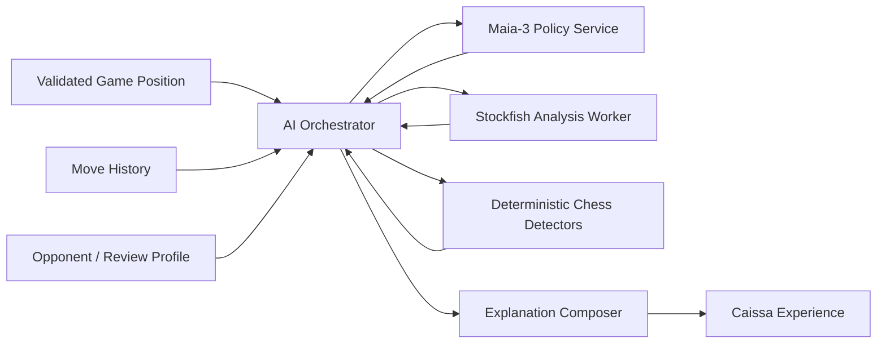
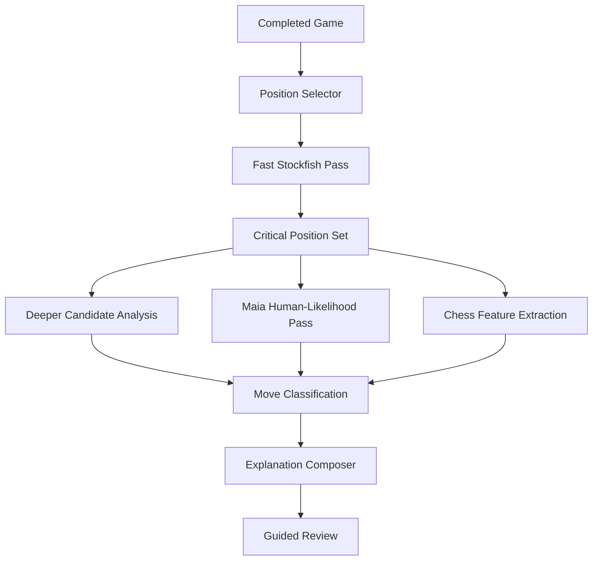

# Caissa — AI Architecture Document

**Document ID:** CAISSA-AI-001  
**Document Type:** Artificial Intelligence Architecture and Model Governance Specification  
**Version:** 1.0  
**Status:** Approved for AI Implementation Planning  
**Product:** Caissa  
**Product Slogan:** Beyond the Best Move  
**Prepared:** July 2026  
**Owner:** Md. Saminul Amin  
**Primary Audience:** AI Engineering, Backend Engineering, Frontend Engineering, Chess Domain Reviewers, QA, Product, DevOps, and Codex-assisted development

---

## 1. Purpose

This document defines the artificial-intelligence architecture of Caissa.

It specifies how Caissa will use:

- Maia-3 for human-like move prediction
- Stockfish for objective chess analysis
- Deterministic chess heuristics for structured explanations
- Optional future language models for natural-language refinement
- Offline benchmark suites for model validation
- Runtime monitoring for latency, reliability, and drift
- Product safeguards for honest and understandable AI behavior

The document defines the responsibilities, boundaries, inputs, outputs, evaluation methods, fallback behavior, release gates, and governance rules for every AI-powered capability in the product.

This is an implementation and quality-control document. It is not a marketing description of “AI.”

---

## 2. Related Documents

This document must remain consistent with:

- `00_product_identity.md`
- `01_prd.md`
- `02_ux_specification.md`
- `03_design_system.md`
- `04_technical_specification.md`
- `05_architecture_design.md`
- `07_testing_strategy.md` — planned
- `08_deployment_and_release.md` — planned
- `09_coding_guidelines.md` — planned

When conflicts occur, apply this order:

1. Chess legality and result correctness
2. Security, privacy, and data integrity
3. Honest representation of model capability
4. Accessibility and user comprehension
5. Product and UX requirements
6. This AI architecture
7. Optimization convenience

---

# 3. AI Product Philosophy

Caissa uses AI to make chess more humanly understandable.

It does not use AI merely to:

- Maximize playing strength
- Produce impressive-looking numbers
- Generate excessive commentary
- Label every move dramatically
- Pretend to understand a player’s private thoughts
- Replace clear chess evidence with fluent speculation

The governing principle is:

> Use Maia to model what people are likely to play.  
> Use Stockfish to evaluate what is objectively strong.  
> Use structured evidence to explain the difference.

This separation is fundamental.

---

# 4. AI Goals

## 4.1 Primary Goals

The AI system must:

1. Provide believable human-like opponents.
2. Support opponent behavior across configurable skill levels.
3. Distinguish likely human moves from objectively best moves.
4. Identify meaningful turning points after a game.
5. Explain mistakes without humiliating the player.
6. Provide useful alternatives grounded in legal engine analysis.
7. Remain honest about uncertainty.
8. Fail without corrupting the game.
9. Remain observable, versioned, and testable.
10. Support gradual model upgrades without redesigning the product.

## 4.2 Secondary Goals

The AI system should:

- Produce varied but plausible games.
- Support human-likelihood comparisons by skill level.
- Help users understand why a move was tempting.
- Separate tactical failure from strategic imprecision.
- Support future personalized coaching.
- Allow model comparison and controlled experiments.

## 4.3 Non-Goals for Version 1.0

Version 1.0 will not attempt to:

- Infer the user’s emotions.
- Claim to know the player’s actual intention.
- Create a psychological profile.
- Produce individualized style embeddings.
- Train Maia-3 from scratch.
- Fine-tune a model on private user games.
- Provide authoritative titled-player coaching.
- Replace objective analysis with human-likelihood scores.
- Use a general LLM as the source of chess truth.
- Generate unlimited free-form engine commentary.

---

# 5. Scientific and Technical Baseline

## 5.1 Maia-3

Maia-3 is a family of transformer models designed to predict human chess moves across skill levels.

The official implementation:

- Runs as a UCI-compatible chess engine
- Supports Elo conditioning
- Supports separate side-to-move and opponent Elo
- Supports temperature
- Supports nucleus sampling through top-p
- Supports multiple likely human moves through MultiPV
- Provides released 5M, 23M, and 79M model variants
- Supports reconstructed move history
- Is licensed under AGPL-3.0

The official repository describes:

| Model | Intended Use |
|---|---|
| Maia3-5M | First use, CPU, chess GUI integration |
| Maia3-23M | Higher move-prediction accuracy |
| Maia3-79M | Highest released accuracy |
| Maia3 3M ablation | Research ablation, not production default |

The Chessformer paper reports that the Maia-3 family reaches 57.1% move-matching accuracy in its evaluated setting. This result is a research benchmark, not a guarantee for every rating, time control, opening, or Caissa user.

## 5.2 Stockfish

Stockfish is a strong UCI chess engine used for objective search-based analysis.

Caissa uses Stockfish for:

- Best-move analysis
- Candidate lines
- Evaluation change
- Tactical verification
- Mate detection
- Position comparison
- Review evidence

Stockfish is not used to claim human-likeness.

## 5.3 Semantic Separation

Maia and Stockfish output must never be presented as interchangeable.

| Concept | Maia-3 | Stockfish |
|---|---|---|
| Main question | What move is a human likely to play? | What move is objectively strongest under search? |
| Skill conditioning | Yes | Limited-strength modes approximate weaker play |
| Move probability | Human-policy likelihood | Search ordering is not human probability |
| Evaluation | Human-game outcome/value prediction | Search-based chess evaluation |
| Typical use | Human-like opponent and behavioral insight | Objective analysis and verification |
| Product label | Human-like AI | Analysis engine |

Maia-3’s UCI WDL values are human-game outcome predictions from its value head. Its UCI centipawn field is a compatibility transformation and must not be displayed as though it were a Stockfish search evaluation.

---

# 6. AI System Overview



The AI system has four distinct responsibilities:

1. **Human move modeling**
2. **Objective move analysis**
3. **Chess-fact extraction**
4. **Human-readable explanation composition**

No single model owns all four.

---

# 7. AI Capability Matrix

| Capability | Maia-3 | Stockfish | Deterministic Rules | Future LLM |
|---|---:|---:|---:|---:|
| Select human-like move | Primary | Fallback only | No | No |
| Estimate likely human alternatives | Primary | No | No | No |
| Objective best move | No | Primary | No | No |
| Tactical verification | No | Primary | Supporting | No |
| Legal move validation | No | No | chess rules engine | No |
| Detect hanging piece | No | Supporting | Primary | No |
| Detect material change | No | Supporting | Primary | No |
| Detect check/mate | No | Supporting | Primary | No |
| Explain move in templates | Evidence | Evidence | Primary | Optional refinement |
| Generate polished prose | No | No | Basic | Future |
| Determine player intent | Prohibited | Prohibited | Prohibited | Prohibited |
| Determine move classification | Supporting | Primary evidence | Policy rules | No |

---

# 8. AI Runtime Boundaries

## 8.1 Browser

The browser owns:

- Authoritative game state
- Legal move validation
- Local Stockfish worker
- Review orchestration
- Deterministic feature extraction where lightweight
- Explanation rendering
- AI request cancellation
- Final validation of proposed moves

## 8.2 Maia Service

The Maia service owns:

- Model loading
- Model inference
- Elo conditioning
- Policy sampling
- Candidate probability extraction
- Model health
- Runtime metadata
- Inference metrics

## 8.3 Prohibited Ownership

The Maia service must not own:

- Game clock
- Final result
- Persistent user profile
- Authoritative move history
- Final decision to commit a move
- User-facing explanation prose in Version 1.0

Stockfish must not own:

- Game state
- Move commitment
- User skill rating
- Human-likelihood interpretation

---

# 9. Maia Model Strategy

> **Amended by ADR-0003.** Sections 9 through 18 describe the Version 2 Maia workstream.
> Version 1 ships engine-backed opponent profiles with honest strength labelling; no copy
> in the product claims human-like move prediction.


## 9.1 Launch Model

The initial production model candidate is:

```text
Maia3-5M
```

Reasons:

- Officially positioned for initial use and CPU execution
- Lower memory usage
- Lower startup cost
- Lower inference latency
- Better fit for early deployment
- Adequate for proving the product experience

This selection is provisional until benchmark results meet Caissa’s release gates.

## 9.2 Upgrade Path

Possible model tiers:

| Tier | Model | Purpose |
|---|---|---|
| Standard | 5M | Default gameplay |
| Enhanced | 23M | Higher-fidelity beta or premium compute |
| Research | 79M | Offline evaluation and limited experiments |
| Rejected for normal use | 3M ablation | Paper reproduction only |

The UI must not expose model parameter counts as difficulty levels.

## 9.3 Model Registry

The service must use an allowlisted model registry.

```python
MODEL_REGISTRY = {
    "maia3-5m": {
        "source": "UofTCSSLab/Maia3-5M",
        "purpose": "production-default",
        "enabled": True,
    },
    "maia3-23m": {
        "source": "UofTCSSLab/Maia3-23M",
        "purpose": "evaluation",
        "enabled": False,
    },
}
```

User input may select an approved product profile, not an arbitrary model URL or checkpoint path.

## 9.4 Model Provenance

Every deployed model record must include:

- Product model ID
- Upstream repository/model ID
- Checkpoint hash
- Architecture preset
- License
- Download date
- Build image version
- Enabled rating range
- Validated device modes
- Benchmark report ID

---

# 10. Maia Input Contract

A Maia inference request is derived from a validated game context.

Required information:

```ts
interface MaiaInferenceInput {
  requestId: string;
  fen: string;
  moves: string[];
  sideToMove: "white" | "black";
  selfElo: number;
  opponentElo: number;
  samplingProfile: MaiaSamplingProfileId;
  candidateCount: number;
  expectedPly: number;
}
```

## 10.1 Position History

Move history should be supplied when supported.

Reasons:

- The model supports reconstructed UCI history.
- History may contain relevant contextual information.
- Full move sequence helps distinguish positions with identical board layout but different path-dependent context.
- History assists correct repetition-related context in chess systems generally.

The service validates that the move sequence reconstructs the submitted position.

## 10.2 Elo Conditioning

Caissa should separately represent:

- Side-to-move skill
- Opponent skill

For an AI opponent move:

```text
SelfElo = selected AI profile
OppoElo = estimated or selected player level
```

The initial product may set both to the chosen opponent profile until user-rating support is designed.

This decision must be tested because a symmetric setting and asymmetric setting may produce different behavior.

## 10.3 Input Validation

Reject:

- Invalid FEN
- Illegal reconstructed history
- History inconsistent with FEN
- Unsupported Elo
- Excessive move count
- Unsupported candidate count
- Unknown sampling profile
- Impossible side-to-move state
- Oversized request payload

---

# 11. Maia Output Contract

```ts
interface MaiaInferenceOutput {
  requestId: string;
  selectedMove: string;
  candidates: MaiaMoveCandidate[];
  model: ModelIdentity;
  effectiveSettings: {
    selfElo: number;
    opponentElo: number;
    temperature: number;
    topP: number;
    multiPv: number;
  };
  humanWdl?: {
    win: number;
    draw: number;
    loss: number;
  };
  durationMs: number;
  warnings: string[];
}
```

Candidate:

```ts
interface MaiaMoveCandidate {
  move: string;
  probability: number;
  rank: number;
  humanWdl?: {
    win: number;
    draw: number;
    loss: number;
  };
}
```

## 11.1 Output Validation

Before response:

- Candidate moves must be legal.
- Probabilities must be finite and non-negative.
- Candidate list must be unique.
- Selected move must be present in candidates when candidates are requested.
- Probability normalization behavior must be documented.
- WDL must be labeled as human-game outcome prediction.

Before browser commit:

- Request ID must match.
- FEN must still match.
- Ply must still match.
- Move must remain legal.
- Game phase must still expect an opponent move.

---

# 12. Opponent Profile Architecture

A user selects a product profile, not raw model parameters.

Example initial profiles:

| Product Profile | Conceptual Level | Initial Elo Input | Sampling Style |
|---|---|---:|---|
| Learner | Beginner | benchmark-defined | Conservative |
| Developing | Improving player | benchmark-defined | Realistic |
| Club | Club player | benchmark-defined | Realistic |
| Strong Club | Strong club player | benchmark-defined | Focused |
| Advanced | Advanced player | benchmark-defined | Focused |

Exact Elo mappings must not be frozen until validation.

## 12.1 Profile Definition

```ts
interface HumanLikeOpponentProfile {
  id: string;
  label: string;
  targetElo: number;
  modelId: string;
  samplingProfileId: string;
  thinkTimeProfileId: string;
  openingDiversityProfileId: string;
  fallbackProfileId: string;
}
```

## 12.2 Rating Label Honesty

The UI may say:

```text
Approximately 1400-style decisions
```

It should not say:

```text
Guaranteed 1400 playing strength
```

Move-matching calibration and game-playing Elo are related but not identical.

---

# 13. Sampling Architecture

## 13.1 Purpose

Sampling adds realistic variation.

Without controlled sampling, the model may repeat the same top move frequently.

With excessive sampling, the opponent may become erratic and less human-like.

## 13.2 Official Controls

Maia-3 exposes:

- `Temperature`
- `TopP`
- `MultiPV`

Caissa wraps these in versioned profiles.

## 13.3 Sampling Profiles

Conceptual definitions:

```yaml
deterministic:
  temperature: 0.0
  topP: 1.0
  multiPv: 3

focused:
  temperature: <validated-low-value>
  topP: <validated-high-threshold>
  multiPv: 5

realistic:
  temperature: <validated-medium-value>
  topP: <validated-threshold>
  multiPv: 8

varied:
  temperature: <validated-higher-value>
  topP: <validated-threshold>
  multiPv: 10
```

No unvalidated numeric values should be presented as scientifically correct.

## 13.4 Move Selection Procedure

```text
Receive candidate policy
    ↓
Remove illegal candidates
    ↓
Check candidate integrity
    ↓
Apply profile sampling
    ↓
Apply repetition/diversity guard if enabled
    ↓
Select move
    ↓
Return candidate metadata
    ↓
Browser revalidates
```

## 13.5 Safety Floor

Caissa must not apply a hidden Stockfish filter to every Maia move by default, because doing so would distort human-likeness.

However, experimental safety profiles may prevent catastrophic model/runtime failures such as:

- Invalid output
- Illegal move
- Corrupted probability vector
- Move absent from legal set

A chess-strength filter must be clearly treated as a hybrid opponent mode, not pure Maia.

---

# 14. Opening Diversity

## 14.1 Problem

A deterministic policy may repeatedly select the same common opening moves.

## 14.2 Approved Strategy

Use Maia policy sampling as the primary diversity mechanism.

Optional opening diversity may:

- Encourage selection among high-probability Maia candidates
- Prevent exact repeated opening lines across immediate rematches
- Remain inside a probability threshold
- Preserve opponent profile consistency

## 14.3 Prohibited Strategy

Do not use a generic opening book that forces openings inconsistent with the selected human-like profile without disclosure.

## 14.4 Diversity Memory

Any recent-line memory should be:

- Local to the device
- Short-lived
- Optional
- Used only to select among plausible candidates
- Resettable

---

# 15. Human-Like Think Time

Maia-3 is used for move selection, not assumed to predict thinking time.

Version 1 may use a deterministic think-time simulator.

Inputs:

- Time control
- Remaining clock
- Move number
- Number of legal moves
- Tactical volatility
- Whether position is forced
- Opponent profile
- Actual inference latency

Output:

```ts
interface ThinkTimeDecision {
  minimumDelayMs: number;
  presentationDelayMs: number;
  reasonCode: string;
}
```

Rules:

- Never delay so much that the experience feels broken.
- Never fake a long delay to hide service failure.
- Inference and display delay are measured separately.
- Low-time behavior must respect the clock.
- “Instant” forced moves may be appropriate.
- Think-time simulation must be disableable in testing.

---

# 16. Maia Service Process Architecture

## 16.1 UCI Integration

The official Maia-3 implementation supports UCI and can be launched through its preset commands or module entry point.

The service should initially use a supervised UCI process adapter.

```text
FastAPI
  ↓
Maia Application Service
  ↓
Bounded Worker Pool
  ↓
python-chess UCI Adapter
  ↓
maia3-5m Process
```

## 16.2 Startup

At image build or deployment:

1. Install exact Maia-3 revision.
2. Download and cache approved model checkpoint.
3. Verify checkpoint hash.
4. Start service.
5. Start worker processes.
6. Complete UCI handshake.
7. Load model through readiness call.
8. Run smoke inference.
9. Mark service ready.

The first user request must not trigger a model download.

## 16.3 Worker Configuration

Each worker has:

- Fixed model
- Fixed device
- Fixed architecture preset
- Configurable Elo per request
- Configurable sampling per request
- Maximum request duration
- Process health status

## 16.4 Worker Pool

Use:

- Bounded queue
- Fixed worker count
- One inference at a time per process unless validated otherwise
- Acquisition timeout
- Automatic unhealthy-worker replacement
- Graceful shutdown
- Readiness based on available workers

## 16.5 CPU First

Initial deployment should validate CPU inference with Maia3-5M.

GPU deployment is optional later.

Do not introduce GPU cost before measurements show a user-facing need.

---

# 17. Maia Service API

## 17.1 Endpoints

```text
GET  /api/v1/health
GET  /api/v1/models
GET  /api/v1/profiles
POST /api/v1/maia/move
POST /api/v1/maia/candidates
```

## 17.2 Health

Health response should distinguish:

- Liveness
- Readiness
- Ready worker count
- Model identity
- Service version

## 17.3 Models

The model endpoint returns only approved public metadata.

It must not expose:

- Filesystem paths
- Internal command lines
- Secrets
- Unapproved model URLs

## 17.4 Rate Limits

Rate limiting should account for:

- Requests per minute
- Concurrent requests
- Queue depth
- Candidate count
- Endpoint cost

## 17.5 Stable Error Codes

Examples:

```text
INVALID_POSITION
HISTORY_MISMATCH
UNSUPPORTED_ELO
UNSUPPORTED_PROFILE
MAIA_BUSY
MAIA_TIMEOUT
MAIA_WORKER_FAILED
MODEL_NOT_READY
INVALID_MODEL_OUTPUT
INTERNAL_INFERENCE_ERROR
```

---

# 18. Opponent Fallback Architecture

Fallback hierarchy:

```text
Maia requested
    ↓
One safe retry for transient failure
    ↓
Offer or apply disclosed Stockfish fallback
    ↓
If Stockfish unavailable, pause and preserve game
```

## 18.1 Automatic vs User-Approved Fallback

Product policy options:

- Always ask before changing opponent type
- Automatically fall back when enabled in settings
- Automatically fall back in casual mode only

The selected policy must be explicit.

## 18.2 Fallback Move Quality

Stockfish fallback should use the nearest approved practice profile.

It must not attempt to mimic Maia through uncontrolled random blunders.

## 18.3 Disclosure

Example:

> Human-like AI is temporarily unavailable. Caissa switched to the practice engine for this game.

---

# 19. Stockfish Analysis Architecture

## 19.1 Roles

Stockfish has three analysis roles:

1. Opponent fallback
2. Position evaluation
3. Review evidence

Each role uses a separate versioned configuration.

## 19.2 Analysis Profiles

```ts
interface StockfishAnalysisProfile {
  id: string;
  threads: number;
  hashMb: number;
  multiPv: number;
  searchLimit:
    | { type: "time"; milliseconds: number }
    | { type: "depth"; depth: number }
    | { type: "nodes"; nodes: number };
  showWdl: boolean;
}
```

Example conceptual profiles:

| Profile | Purpose |
|---|---|
| `play-fast` | AI reply |
| `review-screen` | Quick guided review |
| `review-deep` | User-requested deeper analysis |
| `classification` | Stable move comparison |
| `tactical-check` | Verify forcing line |

## 19.3 UCI Lifecycle

The Stockfish adapter should use:

- `uci`
- `isready`
- `setoption`
- `ucinewgame`
- `position`
- `go`
- `stop`
- `quit`

Move history should be supplied when practical.

## 19.4 Evaluation Normalization

Internal representation:

```ts
type ObjectiveEvaluation =
  | { type: "centipawn"; value: number; perspective: "white" }
  | { type: "mate"; moves: number; winner: "white" | "black" };
```

All values must be normalized to one documented perspective.

Do not mix side-to-move and White perspective in storage.

## 19.5 WDL

Stockfish WDL, when used, is separate from Maia WDL.

Store with source:

```ts
interface WdlEstimate {
  source: "stockfish" | "maia";
  win: number;
  draw: number;
  loss: number;
  perspective: string;
  version: string;
}
```

---

# 20. Review Intelligence Pipeline



## 20.1 Stage 1 — Fast Scan

Analyze each eligible position using a bounded low-cost profile.

Collect:

- Evaluation before move
- Evaluation after move
- Best candidate
- Played move rank where possible
- Tactical flags
- Mate transitions

## 20.2 Stage 2 — Candidate Selection

Select potentially instructive positions.

Signals:

- Large evaluation change
- Missed forcing move
- Material loss
- King-safety deterioration
- Transition into forced mate
- Strong Maia likelihood despite objective weakness
- Unusual move for selected rating
- Endgame conversion failure
- Opportunity to simplify safely

## 20.3 Stage 3 — Deeper Analysis

Use higher analysis budget only for selected positions.

Generate:

- Stable best move
- Top alternatives
- Short principal variation
- Objective delta
- Tactical verification

## 20.4 Stage 4 — Human Context

Optionally query Maia for:

- Likelihood of played move
- Likelihood of better move
- Candidate distribution by target rating
- Whether mistake is common/plausible at that profile

## 20.5 Stage 5 — Feature Extraction

Extract structured facts.

## 20.6 Stage 6 — Classification

Assign move label and confidence.

## 20.7 Stage 7 — Explanation

Compose one concise reason and one actionable lesson.

---

# 21. Critical Position Selection

## 21.1 Goal

Do not analyze every move equally in the guided experience.

Guided review should focus on the smallest set of moments that explain the game.

## 21.2 Candidate Score

Conceptual scoring:

```text
instructional_score =
    objective_swing
  + tactical_significance
  + result_impact
  + human_context_value
  + phase_relevance
  - redundancy
  - forced_move_penalty
```

This is a product heuristic, not a scientific formula.

## 21.3 Redundancy Control

Avoid selecting consecutive moves that describe the same tactical sequence unless both decisions are independently instructive.

## 21.4 Target Count

Recommended guided-review range:

- Short game: 1–3 moments
- Medium game: 3–5 moments
- Long game: 4–7 moments

Advanced analysis remains move-by-move.

---

# 22. Move Classification

## 22.1 Principle

Classification is an explanatory aid, not the product’s core truth.

The explanation and evidence matter more than the badge.

## 22.2 Inputs

Classification may use:

- Objective evaluation before
- Objective evaluation after
- Best move evaluation
- Mate status
- Played move rank
- Evaluation uncertainty
- Position complexity
- Forced move status
- Material impact
- Maia likelihood
- Game phase
- Result impact

## 22.3 Labels

Approved vocabulary:

- Best
- Strong
- Good
- Inaccuracy
- Mistake
- Blunder
- Missed opportunity
- Forced

“Brilliant” is deferred until a defensible rule exists.

## 22.4 Classification Confidence

```ts
interface MoveClassification {
  label: MoveLabel;
  confidence: "low" | "medium" | "high";
  evidence: ClassificationEvidence;
  rulesVersion: string;
}
```

## 22.5 Mate Handling

Mate transitions override centipawn thresholds.

Examples:

- Allowing forced mate
- Missing forced mate
- Escaping forced mate
- Delaying mate

## 22.6 Dynamic Thresholds

Fixed centipawn thresholds alone are insufficient.

Thresholds may adapt to:

- Evaluation magnitude
- Position volatility
- Game phase
- Move uniqueness
- Search stability

All rules must be regression-tested.

---

# 23. Human-Likelihood Insight

> **Deferred to Version 2 by ADR-0003.** Version 1 review uses Stockfish evidence only and
> makes no human-likelihood claim.


## 23.1 Purpose

Human-likelihood provides context such as:

> This move was inaccurate, but it is a common-looking choice at this skill level because it develops a piece and appears to create pressure.

## 23.2 Allowed Claims

- “This was among Maia’s likely moves for the selected profile.”
- “Stronger-profile predictions preferred a safer move.”
- “The move was natural but objectively risky.”
- “The alternative was less obvious but tactically necessary.”

## 23.3 Prohibited Claims

- “You intended to attack.”
- “You panicked.”
- “You were overconfident.”
- “Most 1400 players always make this mistake.”
- “Maia proves this is a human move.”

## 23.4 Likelihood Bands

The product may convert probability into qualitative bands only after calibration.

Example:

```text
highly likely
plausible
uncommon
rare
```

Band definitions must be documented per model version.

---

# 24. Chess Feature Extraction

Version 1 should support deterministic detectors for:

- Material balance
- Hanging piece
- Newly attacked piece
- Newly undefended piece
- Fork
- Pin
- Skewer
- Discovered attack
- Double attack
- Back-rank weakness
- King exposure
- Lost castling rights
- Queen trade opportunity
- Passed pawn
- Promotion threat
- Open file
- Weak square
- Development deficit
- Center control change
- Forced check sequence
- Mate threat
- Simplification
- Endgame transition

## 24.1 Detector Output

```ts
interface ChessFact {
  type: ChessFactType;
  severity: "info" | "important" | "critical";
  squares: string[];
  pieces: string[];
  supportedBy: {
    rules: boolean;
    stockfishLine?: string[];
  };
  confidence: number;
}
```

## 24.2 Detector Safety

A detector may produce no result.

It must not force an explanation when evidence is weak.

---

# 25. Explanation Architecture

## 25.1 Version 1 Strategy

Use a deterministic `ExplanationComposer`.

Inputs:

- Move classification
- Objective evaluation
- Best move
- Short verified line
- Chess facts
- Maia likelihood
- Game phase
- Product tone rules

Outputs:

- Headline
- Explanation
- Better-move explanation
- Key lesson
- Evidence metadata

## 25.2 Explanation Schema

```ts
interface ReviewExplanation {
  headline: string;
  summary: string;
  betterMove?: {
    move: string;
    reason: string;
    variation?: string[];
  };
  lesson?: string;
  confidence: "low" | "medium" | "high";
  evidenceIds: string[];
  templateId: string;
  templateVersion: string;
}
```

## 25.3 Composition Order

```text
Identify strongest verified fact
    ↓
Describe consequence
    ↓
Describe better move
    ↓
Describe reusable lesson
    ↓
Apply Caissa tone
```

## 25.4 Example

```text
Headline:
The center became vulnerable.

Summary:
Your kingside plan was reasonable, but this move left the e-pawn without
enough protection and allowed Black to challenge the center immediately.

Better move:
Re1 protected the pawn while keeping your attacking options.

Lesson:
Before starting a flank attack, check whether your center can be opened by
a forcing move.
```

## 25.5 Explanation Length

Guided review:

- Headline: one short sentence
- Summary: one to three sentences
- Lesson: one sentence
- Principal variation: normally two to six plies

Advanced analysis may show more.

---

# 26. Explanation Safety

## 26.1 Evidence Requirement

Every factual explanation must map to structured evidence.

Examples:

- “left the knight undefended” requires board-attack verification
- “allowed mate” requires verified mate line
- “lost material” requires material delta
- “was common-looking” requires Maia candidate evidence

## 26.2 No Intent Attribution

Replace:

> You wanted to win the bishop.

With:

> The move appears to target the bishop.

## 26.3 No False Precision

Avoid:

> This move reduced your winning chance by exactly 17.3%.

Unless the probability source, calibration, and interpretation support that statement.

## 26.4 Uncertainty Language

Approved:

- “The main issue appears to be…”
- “One practical concern is…”
- “Stockfish’s preferred continuation is…”
- “Maia considered this move plausible…”

## 26.5 Conflicting Evidence

When Maia and Stockfish disagree:

> This was a natural human choice, but Stockfish identifies a tactical problem.

Do not hide the disagreement.

---

# 27. Optional Future LLM Layer

## 27.1 Role

A future LLM may improve phrasing, structure, and personalization.

It may not become the source of chess facts.

## 27.2 Input

The LLM receives:

- Structured explanation draft
- Verified move line
- Classification
- Chess facts
- Tone constraints
- Maximum length
- Prohibited claims

## 27.3 Output

Use structured JSON.

## 27.4 Validation

Before display:

- Schema validation
- Move legality check
- Mentioned-square validation where possible
- No unsupported evaluation values
- No intent claims
- No invented opening name
- Fallback to deterministic explanation

## 27.5 Privacy

User games must not be sent to a third-party LLM without clear disclosure and an approved privacy policy.

---

# 28. Opening Identification

Opening naming should use a deterministic local ECO database or approved source.

Rules:

- Opening name is based on move sequence, not LLM inference.
- The longest valid matching sequence wins.
- Transpositions should be handled where data supports them.
- Do not overstate an opening after the game leaves known theory.
- Database version must be recorded.

---

# 29. Endgame Intelligence

Version 1 may use:

- Stockfish
- Deterministic material classification
- Optional local tablebase integration later

Endgame insights may include:

- Winning/losing/drawn transition
- Passed pawn creation
- King activation
- Opposition
- Promotion race
- Simplification decision

Do not claim tablebase certainty without a tablebase result.

---

# 30. Evaluation Dataset

## 30.1 Purpose

Caissa requires an offline benchmark suite independent of production traffic.

## 30.2 Dataset Sources

Use only legally and ethically permitted data.

Possible sources:

- Publicly available human games under acceptable terms
- Official Maia evaluation data if released and license-compatible
- Curated internal chess positions
- Synthetic tactical and rule scenarios
- User-contributed games only with explicit consent

## 30.3 Dataset Slices

Required slices:

- Rating bands
- Opening, middlegame, endgame
- Blitz-like and slower contexts where available
- Tactical and quiet positions
- Winning, equal, and losing positions
- White and Black to move
- Common and rare openings
- Special-rule positions
- Low and high branching factor
- Short and long history

## 30.4 Leakage Control

Do not tune and report on the same benchmark slice.

Maintain:

- Development set
- Validation set
- Locked release test set

---

# 31. Maia Quality Metrics

## 31.1 Move Prediction

- Top-1 move match
- Top-3 move coverage
- Top-5 move coverage
- Negative log-likelihood
- Mean reciprocal rank
- Brier score where applicable
- Calibration error
- Probability entropy

## 31.2 Rating Calibration

Evaluate metrics by:

- Requested profile
- Actual player rating band
- Phase
- Time control
- Position complexity

## 31.3 Diversity

- Unique move rate
- Opening-line diversity
- Rematch line repetition
- Candidate entropy
- Illegal output rate

## 31.4 Game Behavior

- Actual game-playing Elo estimate
- Draw rate
- Resignation/checkmate distribution
- Blunder frequency
- Average centipawn loss
- Opening diversity
- Time-control survival

Game-playing strength must not replace move-prediction metrics.

---

# 32. Stockfish Quality Metrics

- Search stability across repeated runs
- Best-move agreement at target profile
- Evaluation variance
- Mate detection consistency
- Analysis latency
- Cancellation latency
- Worker crash rate
- Browser compatibility
- Memory use
- MultiPV completeness

---

# 33. Review Quality Metrics

## 33.1 Objective Metrics

- Correct move legality
- Correct material claims
- Correct tactical motif precision
- Correct mate claims
- Correct best-move mapping
- Explanation-to-evidence coverage
- Unsupported-claim rate
- Duplicate insight rate

## 33.2 Expert Review

A chess reviewer should score:

- Correctness
- Clarity
- Usefulness
- Tone
- Appropriate depth
- Whether selected moments matter
- Whether lesson generalizes

## 33.3 User Metrics

- Review completion
- Critical moment engagement
- Try-the-move usage
- Play-again rate
- User-rated usefulness
- Confusion reports
- Correction reports

Engagement must not be interpreted as correctness.

---

# 34. Model Calibration Plan

## 34.1 Opponent Calibration

For each profile:

1. Choose candidate Elo conditioning.
2. Choose sampling profile.
3. Run move-prediction benchmark.
4. Run automated game suite.
5. Estimate playing strength.
6. Conduct human playtest.
7. Compare perceived difficulty.
8. Adjust product label.
9. Freeze versioned profile.

## 34.2 Probability Calibration

Check whether moves assigned higher probability occur more frequently in held-out human games.

If calibration is poor:

- Do not display raw percentages.
- Use rank only.
- Use broad qualitative bands after validation.

## 34.3 Cross-Domain Calibration

Test for degradation in:

- Different time controls
- Unusual openings
- Endgames
- Very high/low ratings
- Chess variants

Version 1 supports standard chess only.

---

# 35. Latency Architecture

## 35.1 Targets

Initial service objectives:

| Operation | Target |
|---|---:|
| Maia service health | P95 ≤ 250 ms |
| Warm 5M move inference | P50 ≤ 500 ms, P95 ≤ 2 s |
| Maia browser round trip | P95 ≤ 3 s |
| Queue wait | P95 ≤ 500 ms under normal load |
| Stockfish play move | Profile-dependent, bounded |
| Guided review first insight | ≤ 5 s target |
| Full guided review | Progressive, ≤ 20 s target |

These are product targets, not guaranteed properties of the upstream model.

## 35.2 Timeout

Suggested initial hard Maia timeout:

```text
5 seconds
```

This should be adjusted after deployment measurement.

## 35.3 Progressive Review

Review should show:

1. Game summary
2. First critical moment
3. Remaining moments as they become ready

Do not block the whole review until every position is analyzed.

---

# 36. Caching

## 36.1 Maia Cache

Deterministic candidate requests may be cached using:

- Model ID
- Model hash
- FEN
- Move history digest
- Self Elo
- Opponent Elo
- Temperature
- Top-p
- MultiPV

Sampled selected moves should not be blindly served from shared cache.

## 36.2 Stockfish Cache

Cache by:

- Engine version
- FEN/history
- Search profile
- Options
- MultiPV

## 36.3 Review Cache

Cache:

- Position analyses
- Move classifications
- Generated deterministic explanations

All records include version metadata.

## 36.4 Eviction

Use bounded storage with:

- Size limit
- Least-recently-used behavior
- Independent clearing of disposable analysis data
- Preservation of game PGN

---

# 37. Observability

## 37.1 Maia Metrics

- Requests
- Success rate
- Latency
- Queue depth
- Queue wait
- Worker count
- Ready worker count
- Worker restart
- Model load time
- Invalid output
- Illegal output
- Timeout
- Candidate entropy
- Requested profile distribution

## 37.2 Review Metrics

- Games reviewed
- Positions scanned
- Critical positions selected
- Analysis time
- Partial-review rate
- Detector precision samples
- Unsupported-claim alerts
- Template usage

## 37.3 Logs

Structured fields:

- Request ID
- Service version
- Model ID
- Profile ID
- Duration
- Status
- Error code
- Worker ID

Do not log full private game histories by default.

---

# 38. Drift and Regression

## 38.1 Sources of Regression

- Model checkpoint update
- Maia package update
- Stockfish version update
- Sampling profile change
- Explanation rule change
- Browser engine build change
- Dataset shift
- API parser change

## 38.2 Golden Set

Maintain a locked set of positions with expected:

- Legal candidate set
- Candidate ordering range
- Selected deterministic move
- Stockfish evaluation range
- Classification
- Explanation evidence

Probabilistic tests should use tolerances or seeded deterministic settings.

## 38.3 Release Comparison

Every AI release compares against the current production version.

No upgrade is accepted solely because it is newer.

---

# 39. Model Versioning

## 39.1 Version Identity

```ts
interface AiVersionIdentity {
  caissaAiVersion: string;
  maiaModelId?: string;
  maiaCheckpointHash?: string;
  maiaPackageRevision?: string;
  stockfishVersion?: string;
  stockfishBuildHash?: string;
  samplingProfileVersion: string;
  classificationRulesVersion: string;
  explanationTemplateVersion: string;
  featureDetectorVersion: string;
}
```

## 39.2 Stored With Review

Every saved review must record the complete AI version identity.

## 39.3 Regeneration

A user may later regenerate a review with a newer version.

Original review should remain identifiable.

---

# 40. AI Release Gates

A Maia profile may ship only when:

- Illegal output rate is zero in the release suite.
- Service survives stress testing.
- Warm inference meets latency target or approved exception.
- Candidate probabilities pass integrity checks.
- Rating behavior is evaluated.
- Diversity is acceptable.
- Human playtest finds behavior believable.
- Fallback behavior works.
- License obligations are met.
- Version metadata is complete.

A review release may ship only when:

- No illegal recommended move appears.
- Mate claims are verified.
- Material claims pass tests.
- Unsupported-claim rate meets target.
- Critical moment selection is reviewed.
- Tone meets product standard.
- Partial review remains useful.
- Failure preserves the game and PGN.

---

# 41. AI Safety and Trust

## 41.1 Honest Labels

Use:

- Human-like move prediction
- Objective engine analysis
- Estimated move likelihood
- Approximate skill profile

Avoid:

- Thinks like you
- Understands your psychology
- Perfect coach
- Knows why you moved
- Exact human rating guarantee

## 41.2 User Control

Users should be able to:

- Choose opponent type
- Disable human-like AI
- Continue without analysis
- Export games
- Delete local reviews
- See model information
- Report incorrect explanations

## 41.3 Correction Flow

A review insight may offer:

```text
Report this explanation
```

Possible categories:

- Chess fact is wrong
- Suggested move is unclear
- Language feels judgmental
- Explanation is not useful
- Other

---

# 42. Bias and Limitations

Human game data may reflect:

- Platform population
- Rating distribution
- Time controls
- Opening popularity
- Historical period
- Selection effects
- Region and access patterns
- Cheating or anomalous games
- Differences between online and over-the-board play

Caissa must not imply that Maia represents every human player equally.

The About AI section should explain:

- Human-likeness is learned from recorded game data.
- Predictions are population-level estimates.
- Skill labels are approximate.
- Unusual positions may reduce reliability.
- Objective quality and human likelihood are different.

---

# 43. Privacy

Version 1 should not require sending completed games to the Maia service beyond the context needed for a move request.

For opponent play, send:

- Position
- Relevant history
- Ratings/profile
- Request metadata

Do not send:

- Name
- Email
- Local history
- Unrelated games
- Device identifiers beyond operational necessity

If future cloud review sends a complete game:

- Disclose it.
- Minimize retention.
- Define deletion.
- Avoid third-party training use without consent.

---

# 44. Security

## 44.1 Model Service

- Allowlisted models only
- No user-supplied checkpoint
- No shell command construction
- Bounded request size
- Elo bounds
- Candidate-count bounds
- Timeout
- Rate limit
- Bounded queue
- Non-root container
- Checkpoint hash verification

## 44.2 Output Safety

Treat UCI output as untrusted process output.

- Parse strictly.
- Reject malformed lines.
- Reject illegal move.
- Limit line length.
- Limit candidate count.
- Prevent log injection.

## 44.3 Explanation Safety

- Escape text.
- Use internal templates.
- Never render untrusted HTML.
- Validate all move notation.

---

# 45. Failure Modes

| Failure | Required Behavior |
|---|---|
| Model not cached | Service not ready; no request accepted |
| Maia worker crashes | Fail request, restart worker |
| Queue full | Return retryable busy error |
| Maia timeout | Retry once, then fallback |
| Invalid move output | Reject, mark worker unhealthy |
| Stale response | Browser ignores it |
| Stockfish worker crash | Recreate worker |
| Review analysis timeout | Save partial review |
| Detector disagreement | Use lower-confidence explanation or omit |
| LLM failure, future | Use deterministic explanation |
| Cache corruption | Clear disposable cache only |
| Network offline | Continue local core |

---

# 46. AI Testing Strategy

## 46.1 Unit Tests

- Sampling profile mapping
- Probability parsing
- Candidate normalization
- Elo validation
- Error mapping
- Classification rules
- Chess detectors
- Explanation templates
- Version metadata
- Cache keys

## 46.2 Integration Tests

- FastAPI to UCI process
- Worker acquisition/release
- Timeout and restart
- Browser Maia client contract
- Stockfish worker parser
- Review pipeline
- Partial review persistence

## 46.3 Adversarial Tests

- Malformed FEN
- Contradictory history
- Duplicate candidates
- NaN probability
- Illegal best move
- Very long history
- Worker output flood
- Slow process
- Process exit mid-request
- Stale browser response
- Position changed during request

## 46.4 Human Evaluation

Playtesters should assess:

- Believability
- Difficulty
- Variety
- Frustration
- Repetition
- Review usefulness
- Tone
- Trust

---

# 47. AI Experimentation

Experiments must be versioned and isolated behind flags.

Examples:

- 5M vs 23M
- Deterministic vs sampled Maia
- Symmetric vs asymmetric Elo conditioning
- Different sampling profiles
- Maia-only vs hybrid safety profile
- Review with vs without human-likelihood context

Experiment success must include correctness and trust, not only engagement.

---

# 48. Cost Architecture

## 48.1 Cost Drivers

- Maia worker count
- Model size
- CPU/GPU selection
- Request volume
- Candidate count
- Review queries
- Logging retention
- Network egress

## 48.2 Cost Controls

- 5M default
- Bounded MultiPV
- Cache deterministic candidates
- Fixed worker pool
- No model download per request
- No remote Stockfish requirement
- No LLM in Version 1
- Rate limits
- Progressive review

---

# 49. AI Implementation Phases

## Phase 1 — Stockfish Foundation

- Browser worker
- UCI parser
- Objective evaluation
- Candidate lines
- Cancellation
- Review fixtures

## Phase 2 — Maia Service Prototype

- Official Maia3-5M
- Single warm process
- Move endpoint
- Strict validation
- Local benchmark

## Phase 3 — Production Maia Service

- Worker pool
- Model cache
- Health/readiness
- Rate limits
- Metrics
- Browser fallback

## Phase 4 — Opponent Profiles

- Elo conditioning study
- Sampling calibration
- Think-time profiles
- Human playtests
- Product labels

## Phase 5 — Guided Review

- Fast scan
- Critical positions
- Deeper Stockfish analysis
- Deterministic detectors
- Explanation templates

## Phase 6 — Human Context

- Maia candidate likelihood
- Natural-vs-best comparison
- Skill-level comparison
- Calibrated language

## Phase 7 — Advanced AI

- Larger Maia models
- Optional LLM wording
- Personalized coaching research
- Style modeling only after privacy review

---

# 50. Codex AI Task Protocol

Codex tasks involving AI must include:

- Exact model or engine boundary
- Allowed files
- Input/output schema
- Timeout
- Validation rules
- Failure behavior
- Test fixtures
- Version metadata
- Prohibited claims

Example:

```text
Implement Maia candidate response parsing for the FastAPI service.

Use:
- 06_ai_architecture.md sections 10, 11, 16, and 17
- 05_architecture_design.md section 21

Constraints:
- Do not execute shell strings.
- Accept only the allowlisted maia3-5m worker.
- Reject illegal or duplicate UCI moves.
- Preserve human WDL separately from Stockfish evaluation.
- Add tests for malformed probability, duplicate move, timeout, and worker exit.
- Do not generate user-facing explanation text.
```

---

# 51. AI Architecture Decision Records

Recommended ADRs:

```text
0009-maia3-5m-launch-model.md
0010-maia-through-uci-process.md
0011-human-and-objective-evaluation-separation.md
0012-versioned-sampling-profiles.md
0013-deterministic-explanations-first.md
0014-progressive-review-generation.md
0015-no-raw-maia-centipawn-display.md
0016-no-user-checkpoint-selection.md
```

---

# 52. Locked AI Decisions

The following are approved:

1. Maia-3 provides human-like policy predictions.
2. Stockfish provides objective analysis.
3. Maia WDL is never presented as Stockfish evaluation.
4. Maia3-5M is the initial deployment candidate.
5. Maia runs remotely behind FastAPI.
6. The official UCI interface is the initial integration path.
7. Models are pre-cached and workers remain warm.
8. Product profiles wrap Elo and sampling settings.
9. Raw sampling controls are not exposed to normal users.
10. Every Maia move is revalidated in the browser.
11. A Maia failure never destroys the game.
12. Stockfish fallback is disclosed.
13. Deterministic explanations ship before LLM explanations.
14. Every explanation requires structured evidence.
15. Player intent is never asserted as fact.
16. Reviews are progressive and may be partial.
17. Every AI output stores version provenance.
18. AI release gates include correctness, latency, trust, and licensing.

---

# 53. Open AI Decisions

Resolve through benchmarking and later ADRs:

1. Exact supported Elo range
2. Final profile-to-Elo mapping
3. Symmetric or asymmetric Elo conditioning
4. Exact temperature values
5. Exact top-p values
6. Default MultiPV
7. Whether 23M is affordable for production
8. Exact Maia worker count
9. CPU host specification
10. Exact opponent think-time formula
11. Opening diversity policy
12. Objective thresholds for move labels
13. Maia likelihood display bands
14. Whether raw probabilities are ever shown
15. Review position-count limits
16. Whether Maia is queried during every review
17. Exact detector implementation order
18. Whether an LLM is included after Version 1
19. Whether user feedback is stored remotely
20. Whether cloud review is introduced

---

# 54. AI Review Checklist

Before approving an AI feature:

## Correctness

- Is every move legal?
- Is every line engine-verified?
- Is every factual claim evidence-backed?
- Are Maia and Stockfish semantics separated?

## Honesty

- Does wording avoid false certainty?
- Is skill described approximately?
- Are limitations visible?
- Is model identity traceable?

## Resilience

- Is timeout defined?
- Is cancellation supported?
- Is stale output rejected?
- Is fallback safe and disclosed?

## Quality

- Is there an offline benchmark?
- Are metrics segmented?
- Has a chess reviewer evaluated it?
- Has user trust been tested?

## Operations

- Is the model cached?
- Is the worker observable?
- Are rate limits present?
- Are license obligations satisfied?

---

# 55. AI Acceptance Criteria

This AI architecture is implementation-ready when:

- Maia and Stockfish responsibilities are unambiguous.
- Maia input/output contracts are approved.
- Opponent profiles are structurally defined.
- Sampling settings are versioned.
- Fallback behavior is defined.
- Stockfish analysis profiles are separated.
- Review stages are defined.
- Move classification evidence is defined.
- Explanation safety rules are defined.
- Benchmark metrics are approved.
- Latency and reliability targets exist.
- Version provenance is specified.
- Release gates are defined.
- Security and privacy constraints are documented.
- Open decisions are assigned to empirical validation.

---

# 56. Definition of Done for AI Version 1

AI Version 1 is complete when:

1. A player can complete a game against Maia through the production service.
2. Every Maia move is legal and position-matched.
3. Human-like AI failure degrades safely.
4. Stockfish analysis runs locally and off the main thread.
5. Maia and Stockfish outputs are labeled distinctly.
6. Opponent profiles are calibrated through benchmark and playtest.
7. A completed game can produce a progressive guided review.
8. Every review claim maps to structured evidence.
9. No free-form model can invent a move or chess fact.
10. Reviews remain useful if Maia is unavailable.
11. AI version metadata is saved with results.
12. Service latency and error rates are observable.
13. Model, engine, and license provenance are documented.
14. Locked benchmark suites pass.
15. A chess reviewer approves the release sample.
16. User-facing copy meets Caissa’s respectful tone.
17. No AI failure can corrupt or erase a game.

---

# 57. Research and Source Basis

This specification is based on the official and primary technical sources available at preparation time.

## Maia-3

- CSSLab, **Maia-3: Human-like Chess Play and Analysis Engine**  
  Official repository and inference instructions:  
  `https://github.com/CSSLab/maia3`

- Daniel Monroe, George Eilender, Philip Chalmers, Zhenwei Tang, and Ashton Anderson, **Chessformer: A Unified Architecture for Chess Modeling**  
  arXiv:  
  `https://arxiv.org/abs/2605.19091`

## Earlier Maia Work

- Reid McIlroy-Young, Siddhartha Sen, Jon Kleinberg, and Ashton Anderson, **Aligning Superhuman AI with Human Behavior: Chess as a Model System**  
  `https://arxiv.org/abs/2006.01855`

## Stockfish

- Official Stockfish repository:  
  `https://github.com/official-stockfish/Stockfish`

- Official UCI and command documentation:  
  `https://official-stockfish.github.io/docs/stockfish-wiki/UCI-%26-Commands.html`

The exact dependency revisions used by Caissa must be recorded separately in release metadata.

---

# 58. Final AI Direction

Caissa’s AI should not feel intelligent because it speaks confidently.

It should feel intelligent because it distinguishes:

- What is legal
- What is strong
- What is likely
- What is uncertain
- What is useful to learn

The final governing rule is:

> Maia explains the human possibility.  
> Stockfish establishes the chess reality.  
> Caissa turns the difference into a lesson.

The system must preserve that distinction in its code, data, interface, and language.
