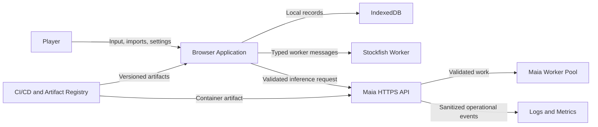

# Caissa — Security and Privacy Specification

**Document ID:** CAISSA-SEC-001  
**Document Type:** Security Architecture, Privacy Engineering, and Governance Specification  
**Version:** 1.0  
**Status:** Approved for Security Implementation and Release Planning  
**Product:** Caissa  
**Product Slogan:** Beyond the Best Move  
**Prepared:** July 2026  
**Owner:** Md. Saminul Amin  
**Primary Audience:** Frontend Engineering, Backend Engineering, AI Engineering, QA, DevOps, Product, Security Reviewers, Privacy Reviewers, Release Managers, and Codex-assisted development

---

## 1. Purpose

This document defines how Caissa protects players, local game data, browser state, engine integrations, the Maia inference service, deployment credentials, logs and telemetry, software-supply-chain integrity, AI trust, and future account features.

It converts the approved product, technical, architecture, AI, testing, deployment, and coding decisions into an implementation-ready security and privacy posture.

This specification covers:

- Security objectives
- Privacy principles
- Threat modeling
- Data classification
- Data inventory and flows
- Browser security
- API security
- Maia process security
- Engine isolation
- Local-storage protection
- Secrets management
- Dependency and supply-chain security
- Logging and monitoring
- Incident response
- User control
- Data retention
- Vulnerability management
- Release gates
- Future regulatory readiness

This document does not claim that Caissa is legally compliant with every jurisdiction. Formal compliance requires jurisdiction-specific legal review, actual production practices, contracts, notices, and evidence.

---

## 2. Related Documents

This specification must remain consistent with:

- `00_product_identity.md`
- `01_prd.md`
- `02_ux_specification.md`
- `03_design_system.md`
- `04_technical_specification.md`
- `05_architecture_design.md`
- `06_ai_architecture.md`
- `07_testing_strategy.md`
- `08_deployment_and_release.md`
- `09_coding_guidelines.md`
- `11_project_roadmap.md` — planned

When conflicts occur, apply this priority:

1. Protection of users and data
2. Chess-state integrity
3. Honest AI behavior
4. Accessibility
5. Privacy by default
6. Product and UX requirements
7. This specification
8. Operational convenience

---

# 3. Security and Privacy Philosophy

Caissa should be secure because it collects little, trusts little, isolates expensive systems, validates every boundary, and preserves player control.

The product should not require players to surrender personal information merely to play chess.

The governing principles are:

> Keep personal data out of the system unless it creates clear user value.

> Treat every external input and model output as untrusted.

> Keep the local game authoritative.

> Make privacy-preserving behavior the default rather than an advanced setting.

> Never use security claims as marketing unless they are supported by evidence.

---

# 4. Security Objectives

## 4.1 Confidentiality

Prevent unauthorized exposure of:

- Deployment secrets
- Service credentials
- Internal logs
- Private release configuration
- Future account data
- User-submitted games when remote features are introduced

## 4.2 Integrity

Prevent unauthorized or accidental modification of:

- Active game state
- Saved games
- Clock state
- PGN
- Engine move proposals
- AI model metadata
- Release artifacts
- Database migrations
- Configuration
- Logs and audit records

## 4.3 Availability

Maintain:

- Local chess gameplay during remote-service failure
- Recovery from Stockfish worker crashes
- Maia service health and controlled fallback
- Access to saved games
- PGN export during degraded states
- Rollback capability

## 4.4 Authenticity

Ensure users and systems can distinguish:

- Official web builds
- Official itch.io builds
- Approved Maia service endpoints
- Deployed model versions
- Trusted release artifacts

## 4.5 Accountability

Maintain enough structured evidence to understand which version was deployed, which model answered a request, which failure occurred, which configuration changed, and which release introduced a regression.

Accountability must not become unnecessary surveillance.

---

# 5. Privacy Objectives

Caissa should provide:

- Data minimization
- Purpose limitation
- Local-first storage
- Clear disclosure
- User access to their data
- User-controlled export
- User-controlled deletion
- Limited retention
- No hidden advertising profile
- No unrelated model training
- No unnecessary account requirement

Privacy requirements should be considered during feature design, not added after implementation.

---

# 6. Security Standard Baseline

Caissa’s secure-development requirements should be mapped against the current OWASP Application Security Verification Standard.

The project should initially target a practical subset aligned with an internet-accessible application handling limited user data, while applying stronger controls to supply chain, engine subprocesses, AI inference, persistence migrations, and deployment credentials.

The security checklist must reference the exact ASVS version used during release review. At document preparation, OWASP ASVS 5.0 is the current major standard.

---

# 7. Privacy-Risk Baseline

Caissa’s privacy program should use a risk-management approach based on:

- Data inventory
- Processing purpose
- User impact
- Data minimization
- Transparency
- User control
- Security safeguards
- Retention
- Third-party risk

The NIST Privacy Framework may be used as a voluntary organizing reference.

Regulatory concepts such as privacy by design, privacy by default, and data minimization should influence implementation even before any formal legal-compliance claim is made.

---

# 8. Scope

## 8.1 In Scope

- Static web application
- itch.io HTML5 build
- Browser local storage
- Stockfish Web Worker
- Maia API
- Maia model workers
- Build and release pipelines
- Logs and metrics
- Optional analytics
- PGN/FEN imports
- Third-party packages
- Fonts, sounds, and assets
- Future account-readiness boundaries

## 8.2 Out of Scope for Version 1

- User authentication
- Password storage
- Payment processing
- Online multiplayer
- Private messaging
- Cloud-synchronized game history
- Public profiles
- Social features
- Advertising
- Sensitive demographic profiling
- Biometric data
- Location tracking

If any out-of-scope capability is introduced, this document must be revised before implementation.

---

# 9. System Trust Boundaries



## 9.1 Browser Trust Boundary

The browser is under the player’s control and cannot be treated as a trusted secret-holding environment.

## 9.2 Remote API Boundary

All browser-to-Maia traffic crosses an untrusted network and requires HTTPS, validation, rate control, and output verification.

## 9.3 Model Process Boundary

The model process is isolated from HTTP concerns and must not receive raw user-controlled command strings.

## 9.4 Supply-Chain Boundary

Every dependency, engine binary, model checkpoint, asset, and deployment workflow is a supply-chain input.

---

# 10. Threat Actors

Potential threat actors include:

- Opportunistic internet attackers
- Automated scanners
- Abusive clients consuming Maia capacity
- Malicious users submitting crafted PGN/FEN
- Supply-chain attackers
- Compromised dependency maintainers
- Compromised deployment credentials
- Malicious or careless contributors
- Users modifying their own browser/client
- Attackers attempting command injection into engine processes
- Attackers exploiting iframe or browser-hosting behavior

The product does not assume ordinary players are hostile, but all externally controlled input must be handled safely.

---

# 11. Protected Assets

## 11.1 Player Assets

- Active-game state
- Saved PGN
- Review data
- Preferences
- Optional local history
- User trust

## 11.2 Service Assets

- Maia availability
- Model files
- Worker-pool integrity
- API configuration
- Rate-limit state
- Logs and metrics

## 11.3 Development Assets

- Source repository
- CI/CD workflows
- Deployment credentials
- Package-registry credentials
- Release artifacts
- Signing or attestation keys
- Environment configuration

## 11.4 Intellectual and Operational Assets

- Product architecture
- Model profile calibration
- Deterministic review rules
- Internal incident information

Security controls must not be used to conceal source required by applicable open-source licenses.

---

# 12. Threat Modeling Method

Caissa should maintain a lightweight threat model using:

- Data-flow diagrams
- Trust boundaries
- STRIDE-style threat categories
- Abuse-case analysis
- Privacy-impact analysis
- Release-specific review

| Category | Example |
|---|---|
| Spoofing | Fake Maia endpoint |
| Tampering | Modified game record or artifact |
| Repudiation | Untraceable production change |
| Information disclosure | Secret or game-data leakage |
| Denial of service | Maia request flooding |
| Elevation of privilege | Workflow-token abuse |

The threat model must be revisited when accounts, cloud storage, multiplayer, payments, third-party LLMs, meaningful analytics, or major hosting changes are introduced.

---

# 13. Principal Abuse Cases

## 13.1 Malicious PGN Import

An attacker supplies PGN headers or comments containing executable markup or oversized content.

Required controls:

- Parse as data
- Escape rendered metadata
- Apply file-size limits
- Apply move-count limits
- Reject unsupported malformed content
- Never render imported HTML

## 13.2 Forged Maia Response

A compromised or unexpected endpoint returns an illegal move.

Required controls:

- HTTPS
- Approved API origin
- Runtime response schema
- Request ID matching
- FEN/ply matching
- Local legal-move validation
- Reject and preserve game

## 13.3 Maia Resource Exhaustion

An attacker floods inference requests.

Required controls:

- Rate limits
- Bounded queue
- Timeouts
- Candidate-count limits
- Body-size limits
- Concurrency limits
- Monitoring and temporary blocking

## 13.4 UCI Command Injection

An attacker attempts to place command content into FEN, history, rating, or model fields.

Required controls:

- Strict domain parsing
- Internal command construction
- Allowlisted model identifiers
- No shell interpolation
- Argument-list subprocess execution

## 13.5 Supply-Chain Compromise

A dependency, engine build, model checkpoint, action, or container base is replaced.

Required controls:

- Locked versions
- Checksums
- Artifact provenance
- SBOM
- Dependency scanning
- Restricted workflow permissions
- Release verification

## 13.6 Local Data Corruption

An incomplete migration or browser failure corrupts saved data.

Required controls:

- Schema validation
- Transactional writes
- Versioned migrations
- PGN preservation
- Export/recovery mode
- Disposable-cache separation

## 13.7 Malicious Embedding Context

Unexpected iframe behavior attempts navigation, focus abuse, or assumptions about parent-frame trust.

Required controls:

- Do not trust parent frame
- Avoid top-window navigation
- Avoid third-party cookies
- Use explicit external links
- Keep local core independent
- Validate behavior in the real itch.io host

---

# 14. Data Classification

| Class | Description | Examples |
|---|---|---|
| Public | Safe for public release | Version, public model name, documentation |
| Internal | Operational but not personal | Build logs, architecture notes |
| User-local | Stored on player device | Games, settings, reviews |
| Operational-sensitive | Could expose operations or aid attacks | Detailed logs, internal metrics |
| Secret | Privileged credential | Deployment token, registry credential |
| Future personal | Introduced only with future accounts | Email, account ID, cloud history |

Version 1 should avoid collecting future-personal data.

---

# 15. Data Inventory

## 15.1 Browser Preferences

Examples:

- Theme
- Board style
- Sound
- Accessibility settings
- Default opponent
- Time control
- Feature preferences

Storage: local browser only  
Sensitivity: low  
Retention: until user clears data or browser removes it

## 15.2 Active Game

Includes FEN, move history, clocks, opponent profile, time control, and game phase.

Storage: IndexedDB  
Sensitivity: user-local

## 15.3 Completed Game

Includes PGN, result, opponent configuration, review status, and version metadata.

Storage: IndexedDB

## 15.4 Review Data

Includes critical positions, engine evaluations, classifications, explanation evidence, and model/engine provenance.

Storage: IndexedDB

## 15.5 Maia Request

Includes FEN, relevant move history, requested profile/Elo, sampling-profile identifier, and request identifier.

Storage: in transit and short-lived service processing; not retained by default.

## 15.6 Operational Logs

May include request ID, endpoint, error code, latency, model ID, worker ID, environment, and service version.

Full games must not be logged by default.

## 15.7 Analytics

Analytics are not part of the default Version 1 requirement.

If enabled, allowed examples include game started, game completed, review opened, engine failure category, and performance timing.

Analytics must exclude full PGN and unnecessary identifiers by default.

---

# 16. Data-Flow Rules

## 16.1 Local Game Flow

```text
Player input
    ↓
Browser game controller
    ↓
Validated local game state
    ↓
IndexedDB
```

No remote request is required for local play.

## 16.2 Maia Opponent Flow

```text
Validated current position
    ↓
Minimal Maia request
    ↓
HTTPS
    ↓
Validated inference service
    ↓
Move proposal
    ↓
Browser revalidation
    ↓
Move commit
```

## 16.3 Review Flow

Default review should use browser-local Stockfish and deterministic explanation logic.

Maia review context may be requested only for positions required by the feature.

## 16.4 Telemetry Flow

Telemetry is independent of game success. A telemetry failure must not block or alter gameplay.

---

# 17. Privacy-by-Default Decisions

The following are approved:

1. No account is required for Version 1.
2. Game history is local by default.
3. Full games are not uploaded for ordinary Maia move requests.
4. Analytics are disabled unless deliberately introduced.
5. No advertising trackers are required.
6. No behavioral advertising profile is created.
7. No personal identity is required to use local play.
8. Remote model requests are minimized.
9. Users can export and delete local records.
10. Model-inference data is not used for unrelated training by default.

---

# 18. Purpose Limitation

Data may be processed only for a clear documented purpose.

| Data | Approved Purpose |
|---|---|
| FEN/history in Maia request | Generate human-like move |
| Local PGN | Restore, review, export game |
| Error code | Diagnose reliability |
| Performance timing | Maintain acceptable performance |
| Optional feedback | Improve the reported explanation |

Data collected for one purpose must not silently be repurposed.

---

# 19. Data Minimization

Before collecting or transmitting a field, ask:

1. Is it required for the feature?
2. Can the feature work locally?
3. Can the data be shortened or aggregated?
4. Can identity be removed?
5. Can retention be avoided?
6. Can the user control it?

Examples:

- Maia does not need the player’s name.
- Engine-error monitoring does not need full PGN.
- Performance metrics do not need a persistent user identifier.
- Local preferences do not need server storage.

---

# 20. User Transparency

Caissa should provide clear user-facing information covering:

- What remains local
- What is sent to Maia
- What optional analytics collect
- How local data can be exported
- How local data can be deleted
- AI limitations
- Third-party services where applicable

Privacy explanations should use plain language and must not rely only on a long legal notice.

---

# 21. User Control

Version 1 should provide controls to:

- Export PGN
- Copy PGN
- Delete an individual game
- Clear game history
- Clear review/analysis cache
- Reset preferences
- Disable optional analytics
- Disable Maia and use local modes
- Continue local play while offline

Destructive operations require appropriate confirmation.

---

# 22. Retention Policy

## 22.1 Browser-Local Data

Retained until the user deletes it, clears site data, the browser evicts it, or a migration removes disposable cache.

## 22.2 Maia Request Content

Default policy:

- Process in memory
- Do not persist full request body
- Do not include full request body in logs
- Remove temporary structures after request completion

## 22.3 Operational Logs

Retain only as long as operationally justified. A specific period must be defined before production.

## 22.4 Security Incident Evidence

Security-event records may require longer retention, but should still minimize personal data.

## 22.5 Analytics

Retention must be defined before analytics is enabled.

---

# 23. Data Deletion

## 23.1 Local Deletion

Deletion must remove the selected game, associated review, and associated disposable analysis cache where identifiable.

## 23.2 Clear-All

Clear-all should distinguish:

- Game history
- Analysis cache
- Preferences
- All local Caissa data

## 23.3 Remote Deletion

Version 1 should avoid retaining remotely identifiable user data.

If future remote retention is added, deletion workflows and identity verification must be designed before launch.

---

# 24. Data Export

Export should provide:

- Standard PGN for games
- Optional JSON for diagnostic or migration support
- Clear filenames
- No hidden remote upload

Export should remain available during degraded modes where data can still be read.

---

# 25. Cookies and Browser Storage

Version 1 should not require tracking cookies.

Browser storage may include IndexedDB, localStorage, and Cache Storage only if PWA support is introduced.

The privacy notice must distinguish functional local storage from analytics or tracking.

A cookie-consent interface should not be shown merely as decoration if no consent-requiring technology is used.

---

# 26. Future Account Readiness

If accounts are introduced, the project must add a new security/privacy design covering:

- Authentication
- Email verification
- Session management
- Passwordless or password security
- Account recovery
- Cloud-data ownership
- Deletion
- Export
- Access control
- Abuse prevention
- Children’s access
- Jurisdictional notices
- Data-processing agreements

Account code must not be improvised inside local-game modules.

---

# 27. Children and Age Considerations

Chess products may be used by minors.

Version 1 does not require age collection.

Before introducing accounts, social features, messaging, personalized advertising, remote profiles, or payments, the project must perform a child-safety and legal review.

Do not collect date of birth without a clear requirement.

---

# 28. Browser Security Requirements

## 28.1 Secure Context

Controlled production hosting and the Maia API must use HTTPS.

## 28.2 Content Security Policy

Controlled hosting should deploy a restrictive CSP.

Conceptual starting direction:

```text
default-src 'self';
script-src 'self';
style-src 'self';
img-src 'self' data:;
font-src 'self';
connect-src 'self' https://approved-maia-host;
worker-src 'self' blob:;
media-src 'self';
object-src 'none';
base-uri 'self';
frame-ancestors 'self';
form-action 'self';
```

The final policy must be tested against Vite output, Web Workers, fonts, audio, itch.io constraints, error monitoring, and approved analytics.

Do not add broad wildcards solely to make deployment easier.

## 28.3 CSP Limitation

CSP is defense in depth. It does not replace output encoding, input validation, safe DOM APIs, or dependency security.

## 28.4 Other Security Headers

Controlled hosting should consider:

- `X-Content-Type-Options: nosniff`
- `Referrer-Policy`
- `Permissions-Policy`
- `Cross-Origin-Opener-Policy`
- `Cross-Origin-Embedder-Policy`
- `Cross-Origin-Resource-Policy`

Header configuration must consider the itch.io build separately.

## 28.5 Frame Policy

The controlled web app may restrict framing. The itch.io build necessarily runs in an itch.io-controlled framing model and must be tested accordingly.

---

# 29. Frontend Input Security

Treat as untrusted:

- PGN
- FEN
- URL parameters
- API responses
- IndexedDB records
- Engine output
- Imported metadata
- User feedback text

Required controls:

- Schema validation
- Length limits
- Escaping
- Safe DOM rendering
- No dynamic code evaluation
- No untrusted HTML
- Clear error behavior

---

# 30. PGN and FEN Security

## 30.1 Import Limits

Define limits for file size, move count, header count, header length, comment length, and variation depth if variations are supported.

## 30.2 Parsing

Use an approved chess parser. Do not parse PGN through ad hoc regular expressions alone.

## 30.3 Rendering

Escape player names, event, site, round, comments, and custom metadata.

## 30.4 Unsupported Content

Version 1 may ignore or reject embedded HTML, unbounded nested variations, unsupported annotations, and binary/non-text input.

---

# 31. Local Storage Security

## 31.1 Threat Model

Browser-local data is available to the user, browser extensions with access, other scripts from a compromised same origin, and anyone with access to the local device/browser profile.

Local storage is not encrypted by default.

## 31.2 Appropriate Data

Store only data whose local exposure is acceptable for the product.

Do not place secrets in IndexedDB or localStorage.

## 31.3 Record Validation

Validate every record when read.

## 31.4 Transaction Integrity

Use transactions for move, clock, and result updates.

## 31.5 Recovery

Preserve PGN when optional metadata is corrupted.

## 31.6 Encryption

Version 1 does not require application-level encryption for local chess games.

If highly sensitive future data is introduced, encryption requires a separate key-management design.

---

# 32. Web Worker Security

- Load only approved same-origin or packaged worker artifacts.
- Use typed messages and validate worker output.
- Do not pass secrets to workers.
- Bound hash memory, threads, search time, and output volume.
- Terminate and recreate unhealthy workers.
- Never allow worker failure to corrupt the game.

---

# 33. Maia API Security

## 33.1 Transport

Production endpoints use HTTPS only.

## 33.2 CORS

Use an explicit allowlist of approved origins.

Do not use permissive wildcard CORS as the default production configuration.

## 33.3 Validation

Validate request schema, FEN, move history, history/FEN consistency, Elo range, candidate count, profile ID, request size, and string lengths.

## 33.4 Rate Limiting

Apply per-source request limits, concurrency limits, queue limits, candidate-count limits, and timeout limits.

## 33.5 Error Responses

Return stable error codes.

Do not expose stack traces, file paths, model cache paths, process command lines, or internal exception objects.

## 33.6 Duplicate Requests

Repeated identical requests must remain subject to capacity controls.

Future authenticated mutations require a separate idempotency design.

---

# 34. Maia Subprocess Security

## 34.1 Executable Control

The executable or module entry point is controlled by trusted deployment configuration.

## 34.2 Model Control

Model identifiers are allowlisted. Users cannot provide model URLs or filesystem paths.

## 34.3 Command Construction

Construct UCI commands internally from validated typed fields.

## 34.4 Shell

Do not invoke a shell unless strictly required and separately reviewed.

## 34.5 Output Parsing

Treat process output as untrusted.

Apply:

- Line-length limits
- Candidate-count limits
- Numeric validation
- Legal-move validation
- Known-prefix parsing
- Unknown-line tolerance with logging limits

## 34.6 Process Isolation

Use a non-root container, resource limits, controlled filesystem, bounded worker pool, automatic restart, and graceful shutdown.

---

# 35. Denial-of-Service Protection

## 35.1 Application Controls

- Body-size limits
- Candidate limits
- History limits
- Timeouts
- Rate limits
- Bounded queues
- Worker count
- Rejection under overload

## 35.2 Infrastructure Controls

Possible controls include reverse-proxy limits, CDN/WAF rate controls, connection limits, benchmark-driven autoscaling, and reputation controls where appropriate.

## 35.3 Graceful Degradation

During Maia overload:

- Return a retryable busy response
- Preserve local game state
- Offer Stockfish fallback
- Do not queue indefinitely

---

# 36. Authentication and Authorization

Version 1 has no end-user authentication.

Operational systems still require access control.

Protect:

- Source repository
- CI/CD
- Deployment environments
- Container registry
- Hosting control panel
- Logs and metrics
- DNS

Use multi-factor authentication, least privilege, individual accounts, no shared administrator password, and periodic access review.

A public browser API key must never be treated as a secret.

---

# 37. Secrets Management

Secrets include deployment tokens, registry credentials, hosting credentials, monitoring credentials, and future service-to-service secrets.

Requirements:

- Centralized protected storage
- Environment scoping
- Least privilege
- Rotation
- Auditability
- No repository storage
- No frontend exposure
- No log output

Environment variables may inject secrets at runtime, but the source of truth should remain a protected secret-management system or deployment environment.

---

# 38. Cryptography

## 38.1 Transport

Use modern TLS through managed HTTPS infrastructure.

## 38.2 Passwords

No user passwords in Version 1.

If introduced, use an established password-hashing approach and dedicated authentication design.

## 38.3 Custom Cryptography

Do not design custom cryptographic algorithms.

## 38.4 Checksums

Use SHA-256 or another approved cryptographic checksum for release-artifact and model verification.

Checksums alone do not prove publisher identity; signing or attestations may be added later.

---

# 39. Security Headers

The final controlled-host security-header configuration must be verified automatically.

At minimum review:

- Content Security Policy
- `X-Content-Type-Options`
- `Referrer-Policy`
- `Permissions-Policy`
- Cross-origin policies
- HSTS where appropriate at the hosting/domain level

Do not add obsolete headers merely to increase checklist count.

---

# 40. Dependency Security

## 40.1 Approval

Every production dependency requires purpose, license, maintenance status, security review, bundle/runtime impact, and replacement difficulty.

## 40.2 Locking

Commit lockfiles. Pin container bases and CI actions appropriately.

## 40.3 Scanning

Run:

- JavaScript dependency scan
- Python dependency scan
- Container scan
- Secret scan
- License scan
- SBOM generation

## 40.4 Updates

Security updates receive priority, but critical chess and migration tests remain mandatory.

---

# 41. Supply-Chain Security

Protect:

- Package manager
- Lockfiles
- CI actions
- Container base
- Stockfish binary/WASM
- Maia package
- Model checkpoint
- Fonts
- Audio assets
- Release artifacts

Required evidence:

- Upstream source
- Version or commit
- License
- Checksum where available
- Build method
- Modification record
- Artifact manifest

---

# 42. CI/CD Security

## 42.1 Workflow Permissions

Grant minimum permissions.

## 42.2 Untrusted Pull Requests

Do not expose production secrets to untrusted pull requests.

## 42.3 Protected Environments

Production deployments require protected environments and approval.

## 42.4 Action Pinning

Pin third-party actions to reviewed versions or immutable revisions where practical.

## 42.5 Artifact Integrity

Release artifacts are immutable, versioned, checksummed, retained, and verified before deployment.

## 42.6 Build Isolation

Build from clean environments and do not depend on undocumented developer-machine state.

---

# 43. Container Security

The Maia container must:

- Run as non-root
- Use a pinned base
- Exclude unnecessary tools
- Expose only the required port
- Use a read-only filesystem where practical
- Use explicit writable temporary paths
- Apply CPU and memory limits
- Have health probes
- Receive secrets at runtime
- Be scanned before release

Do not mount the Docker socket into the application container.

---

# 44. Logging Security

## 44.1 Security Events

Log relevant events such as validation rejection, rate-limit events, worker crashes, model-load failure, repeated invalid output, deployment/version changes, and operational authentication failures.

## 44.2 Log Safety

Never log secrets, authorization headers, full request bodies by default, full PGN by default, personal data without need, or raw malicious content without safe encoding.

## 44.3 Log Integrity

Restrict log access and preserve timestamps and version context.

## 44.4 Alerting

Create actionable alerts for:

- No ready Maia workers
- Elevated invalid-output rate
- Error-rate spike
- Latency spike
- Repeated process restart
- Suspicious request volume
- Secret-detection event
- Critical vulnerability

---

# 45. Privacy-Safe Observability

Operational visibility should prefer:

- Aggregates
- Error codes
- Timings
- Version metadata
- Capability flags
- Anonymous short-lived request IDs

Avoid persistent cross-session identifiers, full game content, personal names, detailed fingerprinting, and exact location.

---

# 46. Analytics Governance

Analytics are not enabled merely because a provider is available.

Before analytics:

1. Define the product question.
2. Define the minimal event.
3. Determine legal/privacy basis.
4. Define retention.
5. Define disclosure.
6. Define opt-out.
7. Review provider contract and processing.
8. Test the payload.
9. Add a kill switch.

Prohibited by default:

- Advertising trackers
- Cross-site tracking
- Full PGN collection
- Persistent fingerprinting
- Selling or sharing user profiles for advertising

---

# 47. Third-Party Services

Maintain a third-party inventory:

| Service | Purpose | Data Sent | Retention | Review | Enabled |
|---|---|---|---|---|---|
| Static host | Serve application | Network metadata | Provider-defined | Required | Planned |
| itch.io | Host HTML5 build | Platform request data | Provider-defined | Required | Planned |
| Maia host | Inference API | Position/history context | Caissa policy | Controlled | Planned |
| Error monitor | Reliability | Sanitized error metadata | Defined before use | Required | Optional |
| Analytics | Product metrics | Minimal events | Defined before use | Required | Disabled by default |

Update this inventory before every new integration.

---

# 48. AI Privacy and Trust

## 48.1 Model Input

Maia receives only data required for inference.

## 48.2 No Hidden Training

Do not use user requests to train or fine-tune models without explicit policy and disclosure.

## 48.3 Provenance

Store model identity and version with relevant review/output records.

## 48.4 Honest Semantics

Distinguish human-likelihood prediction, objective Stockfish evaluation, deterministic explanation, and future language-model wording.

## 48.5 User Intent

Never claim the system knows the player’s private intent or psychology.

---

# 49. Security of AI Explanations

Every factual explanation requires evidence.

Required checks:

- Recommended move is legal
- Mentioned square exists
- Material claim is verified
- Mate claim is engine-verified
- Maia likelihood is labeled correctly
- No untrusted HTML
- No unsupported intent claim

A fluent but unsupported explanation is a security and trust defect.

---

# 50. Privacy Notices

Before public stable release, publish a clear privacy notice containing:

- Who operates Caissa
- What remains local
- What is sent to Maia
- Optional telemetry details
- Retention
- User controls
- Third parties
- Contact method
- Policy-update date

The notice must match actual implementation.

Do not copy a generic policy that describes features Caissa does not have.

---

# 51. Legal and Regulatory Readiness

Caissa should be designed to support future compliance obligations, but must not claim compliance without evidence.

Potentially relevant regimes depend on operator location, user location, age, collected data, business model, and third parties.

Before collecting personal data at scale, obtain legal review.

Privacy engineering should preserve:

- Data inventory
- Purpose records
- Third-party inventory
- Retention rules
- User-control mechanisms
- Security evidence
- Incident records

---

# 52. Data Protection Impact Review

A formal privacy-impact review should be required before:

- Accounts
- Cloud game history
- Personalization
- User profiling
- Children-focused features
- Social features
- Third-party LLM processing
- Advertising
- Payments
- Large-scale game-data collection

The review should assess purpose, necessity, proportionality, risks, safeguards, retention, user control, third parties, and residual risk.

---

# 53. Vulnerability Management

## 53.1 Reporting

Provide a security contact before stable release.

Recommended:

- `SECURITY.md`
- Dedicated email or issue process
- Clear responsible-disclosure instructions

## 53.2 Triage

Every report receives acknowledgment, severity assessment, owner, reproduction, remediation plan, and disclosure coordination where appropriate.

## 53.3 Patch Priority

Critical issues receive immediate attention.

## 53.4 Public Disclosure

Disclose responsibly after remediation, considering user risk.

---

# 54. Security Severity

## Critical

Examples:

- Remote code execution
- Deployment-secret exposure
- Destructive widespread game-data corruption
- Unauthorized production release control
- Malicious model/process command execution

## High

Examples:

- Stored or reflected XSS
- CORS/API flaw enabling abusive use at scale
- Illegal engine output committed broadly
- Significant private-data exposure

## Medium

Examples:

- Limited denial of service
- Missing security header with realistic exploit path
- Excessive logging
- Insecure optional analytics configuration

## Low

Examples:

- Minor information disclosure
- Hardening improvement
- Low-impact configuration inconsistency

Severity considers exploitability and impact.

---

# 55. Security Testing

Required security tests include:

- Malicious PGN metadata
- XSS payloads
- Oversized import
- Invalid FEN
- API body-size limit
- Rate limiting
- Queue saturation
- CORS
- CSP
- Secret scanning
- Dependency scanning
- Container scanning
- Command-injection attempts
- Malformed UCI output
- Invalid Maia move
- Log injection
- Storage corruption
- Unauthorized deployment-attempt simulation where practical

Security test results are release evidence.

---

# 56. Privacy Testing

Verify:

- Local data does not leave the device unexpectedly
- Maia payload contains only approved fields
- Logs exclude full games
- Analytics-disabled state sends nothing
- Export works
- Delete works
- Clear-all works
- Optional analytics disclosure matches payload
- Third-party calls match inventory
- No hidden persistent identifier is created

---

# 57. Security Code Review

High-risk code requires focused review:

- PGN/FEN import
- UCI construction
- Subprocess management
- HTTP validation
- CORS/CSP
- Secrets and workflows
- Database migration
- Model loading
- Logging
- Analytics
- File download/export

Reviewers should identify trust boundary, input, validation, output, failure behavior, abuse limits, and tests.

---

# 58. Secure Defaults

Approved defaults:

- Maia optional
- Analytics off
- No account
- Local game storage
- No public sharing
- No third-party LLM
- No advertising tracker
- No remote PGN retention
- Conservative engine resource limits
- Explicit CORS allowlist
- Non-root container
- Private release environments
- Error details hidden from users

---

# 59. Incident Response

## 59.1 Security Incident Workflow

```text
detect
    ↓
contain
    ↓
preserve evidence
    ↓
assess scope and impact
    ↓
revoke or rotate credentials if needed
    ↓
rollback or patch
    ↓
verify recovery
    ↓
communicate
    ↓
root-cause analysis
    ↓
regression control
```

## 59.2 Privacy Incident

A privacy incident requires assessment of data involved, affected users, sensitivity, exposure duration, third parties, notification duties, and user communication.

Legal counsel should be involved where required.

## 59.3 Evidence Handling

Preserve relevant logs and artifacts while minimizing unnecessary personal data.

---

# 60. Credential-Compromise Procedure

If a deployment or registry secret is exposed:

1. Revoke it.
2. Rotate related secrets.
3. Review access logs.
4. Identify affected workflows.
5. Rebuild and redeploy if artifact integrity is uncertain.
6. Search repository history.
7. Add a preventive control.
8. Document the incident.

Deleting a secret from the latest commit alone is insufficient.

---

# 61. Release Security Gates

A stable release is blocked by:

- Open critical or high security defect
- Secret detected in artifact or repository
- Missing license/source obligations
- Failed dependency or container scan without approved exception
- Unvalidated migration
- Missing CORS or rate-limit controls
- Illegal Maia output in release suite
- CSP or input-sanitization failure in supported deployment
- Privacy notice not matching enabled telemetry
- Missing security contact/process

---

# 62. Security Evidence Package

Every stable release should retain:

- Dependency scan
- Container scan
- Secret scan
- SBOM
- License manifest
- Model manifest
- Security test results
- API contract result
- Header/CORS verification
- Release-artifact checksums
- Deployment version
- Approved exceptions

---

# 63. Exception Management

Security exceptions require:

- Description
- Reason
- Risk
- Compensating control
- Owner
- Approval
- Expiration date
- Remediation plan

No permanent undocumented exception is allowed.

---

# 64. Access Control for Operations

Operational access should follow least privilege.

Review access to repository, CI/CD, DNS, static host, Maia host, registry, logs, error monitoring, and analytics.

Remove access promptly when no longer needed.

Use separate normal and administrative roles where supported.

---

# 65. Secure Development Lifecycle

## Planning

- Threat review
- Data-flow review
- Privacy-purpose review

## Design

- Trust boundaries
- Security controls
- Abuse cases
- Retention

## Implementation

- Validation
- Safe APIs
- Dependency review
- Tests

## Review

- Code review
- Security testing
- Privacy testing

## Release

- Scans
- Evidence
- Approval
- Monitoring

## Operations

- Alerts
- Incident response
- Updates
- Access review

---

# 66. Security Architecture Decision Records

Recommended ADRs:

```text
0017-local-first-privacy-default.md
0018-no-analytics-by-default.md
0019-strict-maia-input-validation.md
0020-allowlisted-models-only.md
0021-no-user-controlled-shell.md
0022-csp-on-controlled-hosting.md
0023-pgn-as-untrusted-data.md
0024-browser-storage-without-app-level-encryption.md
0025-no-remote-game-retention-v1.md
```

---

# 67. Codex Security Task Protocol

Every security-sensitive Codex task must specify:

- Trust boundary
- Allowed inputs
- Validation rules
- Output rules
- Resource limits
- Error behavior
- Logging limits
- Required tests
- Prohibited behavior

Example:

```text
Implement PGN import validation according to:

- 10_security_and_privacy.md sections 29 and 30
- 07_testing_strategy.md section 32
- 09_coding_guidelines.md sections 14 and 24

Requirements:
- Accept text files only.
- Enforce configured byte and move limits.
- Parse using the approved chess library.
- Escape all displayed headers.
- Do not render comments as HTML.
- Return typed validation errors.
- Add tests for XSS metadata, oversized input, malformed PGN, and valid round trip.
- Do not add dependencies.
```

Codex must not weaken validation, introduce wildcard CORS, add secrets, log request bodies, construct shell commands, disable CSP, add tracking without instruction, or claim legal compliance.

---

# 68. Locked Security and Privacy Decisions

The following are approved:

1. Caissa is local-first.
2. No account is required for Version 1.
3. No advertising tracker is required.
4. Analytics are disabled by default.
5. Full games are not retained remotely by default.
6. Maia receives only required inference context.
7. Every remote move is revalidated locally.
8. PGN/FEN and engine output are untrusted inputs.
9. Model IDs are allowlisted.
10. No user-controlled shell command is permitted.
11. The Maia container runs non-root.
12. The Maia queue and request cost are bounded.
13. Production CORS uses an explicit allowlist.
14. Controlled hosting uses a tested CSP.
15. Secrets never enter frontend bundles.
16. Local data can be exported and deleted.
17. Logs exclude full games and secrets by default.
18. Every release includes security and provenance evidence.
19. Security incidents create regression controls.
20. No regulatory-compliance claim is made without formal review.

---

# 69. Open Security and Privacy Decisions

Resolve before stable release or the relevant feature:

1. Exact production domains
2. Exact CSP
3. Exact security-header configuration
4. Exact Maia rate limits
5. Exact request-size limits
6. Exact log retention
7. Exact security contact
8. Exact vulnerability-disclosure process
9. Exact monitoring provider
10. Whether analytics ships
11. Analytics provider and event inventory
12. Exact privacy-notice wording
13. Exact data-controller/operator identity
14. Exact jurisdictional legal review
15. Whether telemetry uses a session identifier
16. Exact IP-retention policy
17. Exact WAF/reverse-proxy controls
18. Whether container/image signing is required
19. Exact access-review cadence
20. Whether PWA caching changes privacy disclosure

---

# 70. Security Review Checklist

## Data

- Is every collected field necessary?
- Is the purpose documented?
- Is retention defined?
- Can the user delete and export it?

## Input

- Is it untrusted?
- Is it validated?
- Is size bounded?
- Is output escaped?

## Browser

- Are secrets absent?
- Is CSP compatible and restrictive?
- Are workers isolated?
- Is local storage validated?

## API

- Is HTTPS required?
- Is CORS explicit?
- Are rate and queue limits present?
- Are errors safe?

## Model

- Is the model allowlisted?
- Is the checkpoint verified?
- Is output validated?
- Is resource usage bounded?

## Operations

- Are secrets scoped?
- Are workflows least-privilege?
- Are artifacts traceable?
- Is rollback available?

## Privacy

- Is local-first behavior preserved?
- Are third parties inventoried?
- Does the notice match reality?
- Are analytics optional?

---

# 71. Security Acceptance Criteria

This specification is implementation-ready when:

- Protected assets and threats are defined.
- Trust boundaries are documented.
- Data classes and flows are documented.
- Privacy defaults are approved.
- Browser and API controls are defined.
- Engine/model process controls are defined.
- Secrets and supply-chain controls are defined.
- Logging and analytics rules are defined.
- Retention, export, and deletion are defined.
- Incident and vulnerability management are defined.
- Release gates are defined.
- Codex security constraints are defined.
- Open legal and operational decisions are identified.

---

# 72. Definition of Done for Security Infrastructure

Security infrastructure is complete when:

1. Production uses HTTPS.
2. CORS is allowlisted.
3. Request bodies and costs are bounded.
4. Maia workers run in a non-root, resource-limited container.
5. Model and release artifacts are checksummed.
6. Secrets are stored in protected deployment environments.
7. Dependency, secret, license, and container scans run in CI.
8. CSP and security headers are tested on controlled hosting.
9. Imported PGN/FEN is validated and safely rendered.
10. Logs exclude secrets and full games by default.
11. Security alerts are configured.
12. A security contact and disclosure process exist.
13. Local export and deletion work.
14. The privacy notice matches actual behavior.
15. Security evidence is retained with releases.
16. Rollback and credential-rotation procedures are documented.

---

# 73. Definition of Done for Version 1 Security and Privacy

Caissa Version 1 is security/privacy-approved when:

1. No critical or high unresolved security defect exists.
2. No secret exists in source or release bundles.
3. The browser commits only locally validated moves.
4. Maia rejects malformed and abusive requests.
5. Model processes cannot be controlled through user-provided commands.
6. Stockfish and Maia failures preserve game integrity.
7. Local records survive tested migrations.
8. PGN/FEN import tests include malicious input.
9. Full game content is absent from default remote logs.
10. Analytics are disabled or fully reviewed and disclosed.
11. Users can export and delete local data.
12. Controlled-hosting security headers pass verification.
13. itch.io behavior is tested in the real embed context.
14. Release artifacts and model versions are traceable.
15. Third-party services are inventoried.
16. License/source obligations are satisfied.
17. Incident-response and rollback procedures exist.
18. Privacy documentation reflects the deployed system.
19. AI limitations and remote processing are transparent.
20. The player can use the core chess experience without creating an identity profile.

---

# 74. Primary Reference Basis

This specification uses the following official security and privacy references as guiding baselines.

## OWASP Application Security Verification Standard

OWASP ASVS provides a structured basis for verifying application security controls.

Official project:

`https://owasp.org/www-project-application-security-verification-standard/`

## OWASP Content Security Policy Guidance

CSP is used as a defense-in-depth browser control and does not replace secure coding.

Official cheat sheet:

`https://cheatsheetseries.owasp.org/cheatsheets/Content_Security_Policy_Cheat_Sheet.html`

## OWASP HTTP Security Headers Guidance

`https://cheatsheetseries.owasp.org/cheatsheets/HTTP_Headers_Cheat_Sheet.html`

## OWASP REST Security Guidance

`https://cheatsheetseries.owasp.org/cheatsheets/REST_Security_Cheat_Sheet.html`

## OWASP Logging Guidance

`https://cheatsheetseries.owasp.org/cheatsheets/Logging_Cheat_Sheet.html`

## OWASP Secrets Management Guidance

`https://cheatsheetseries.owasp.org/cheatsheets/Secrets_Management_Cheat_Sheet.html`

## NIST Privacy Framework

The NIST Privacy Framework is a voluntary risk-management tool for identifying and managing privacy risk.

`https://www.nist.gov/privacy-framework`

## European Union General Data Protection Regulation

Official legal text:

`https://eur-lex.europa.eu/eli/reg/2016/679/oj`

This reference informs privacy-by-design, transparency, data-minimization, and user-control thinking. It does not mean Caissa is automatically compliant.

Exact requirements must be reverified during implementation and before public release.

---

# 75. Final Security and Privacy Direction

Caissa should not ask users to trust it because a page says “secure.”

It should earn trust through architecture and behavior:

- It collects little.
- It stores games locally.
- It validates every engine move.
- It limits remote processing.
- It exposes user controls.
- It records model provenance.
- It contains failures.
- It keeps releases reversible.
- It avoids unsupported privacy claims.

The final principle is:

> Protect the game, minimize the data, verify every boundary, and keep the player in control.

Security and privacy are not finishing tasks.

They are properties of how Caissa is designed, coded, tested, deployed, and explained.
