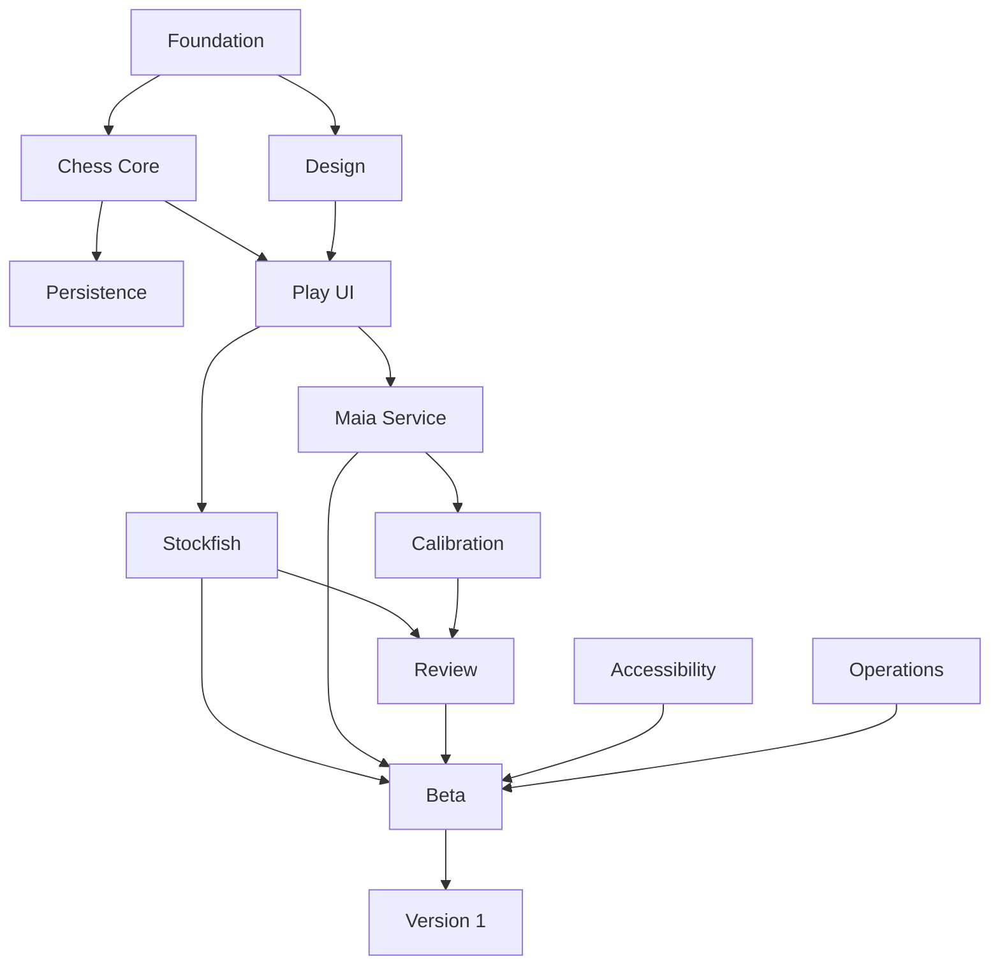

# Caissa — Project Roadmap

**Document ID:** CAISSA-ROADMAP-001  
**Document Type:** Product Delivery Roadmap and Implementation Plan  
**Version:** 1.0  
**Status:** Approved for Execution Planning  
**Product:** Caissa  
**Product Slogan:** Beyond the Best Move  
**Prepared:** July 2026  
**Owner:** Md. Saminul Amin  
**Primary Audience:** Product, Engineering, AI, Design, QA, DevOps, Contributors, and Codex-assisted development

---

## 1. Purpose

This document defines the execution roadmap for Caissa.

It translates the approved product, UX, design, technical, architecture, AI, testing, deployment, coding, security, and privacy documents into a practical implementation sequence.

The roadmap establishes:

- Delivery phases
- Milestones
- Dependencies
- Workstreams
- Required deliverables
- Entry and exit criteria
- Quality gates
- Risks
- Ownership
- Codex-assisted task structure
- Beta and stable release readiness

This is not a calendar promise. It is a controlled sequence of work designed to prevent premature coding, architectural drift, and feature expansion before the product foundation is stable.

---

## 2. Related Documents

This roadmap depends on:

- `00_product_identity.md`
- `01_prd.md`
- `02_ux_specification.md`
- `03_design_system.md`
- `04_technical_specification.md`
- `05_architecture_design.md`
- `06_ai_architecture.md`
- `07_testing_strategy.md`
- `08_deployment_and_release.md`
- `09_coding_guidelines.md`
- `10_security_and_privacy.md`

When roadmap decisions conflict with an approved specification, the specification takes priority unless formally revised.

---

# 2.1 Delivery Status — August 2026

Version 1 is implemented and packaged. This roadmap is retained as the record of how the
work was sequenced; where it disagrees with the ADRs in `docs/adr/`, the ADRs win.

| Phase | Status |
|---|---|
| 1 — Foundation and repository setup | Complete |
| 2 — Product design and interactive prototype | Complete |
| 3 — Chess domain core | Complete |
| 4 — Local persistence and recovery | Complete |
| 5 — Play experience | Complete |
| 6 — Stockfish integration | Complete (bundled, single-threaded; ADR-0002) |
| 7 — Maia-3 service | Deferred to Version 2 (ADR-0003) |
| 8 — Opponent calibration | Complete as engine profiles (ADR-0003) |
| 9 — Guided review intelligence | Complete (Stockfish evidence; human-likelihood deferred) |
| 10 — Accessibility and responsive polish | Complete |
| 11 — Security, performance, and release engineering | Complete |
| 12 — Beta validation | Ready to begin after the first itch.io upload |
| 13 — Stable Version 1 release | Ready |

Phase 7 was removed from Version 1 because a static itch.io release cannot depend on a
remote service. The opponent port is provider-agnostic, so the Maia workstream resumes in
Version 2 without reopening the game controller or any screen.

---

# 3. Product Direction

Caissa is not being built as another generic chess website.

The product direction is:

> A premium, human-centered chess experience where realistic AI opponents and understandable analysis help players enjoy and improve at chess.

The roadmap must preserve three core promises:

1. The game must feel polished.
2. The AI must feel human without being misleading.
3. The review must teach rather than judge.

---

# 4. Roadmap Principles

## 4.1 Build the Core Before the Intelligence

The product must first become a correct, polished chess application. AI is layered on top of a reliable game.

## 4.2 Prove One Complete Experience

The first complete product loop is:

```text
Start game
  ↓
Play against AI
  ↓
Finish game
  ↓
Review key moments
  ↓
Learn one clear lesson
  ↓
Play again
```

The product should not expand into puzzles, multiplayer, social features, or accounts before this loop is strong.

## 4.3 Each Phase Must Produce a Working Artifact

No phase should end with only theory. Each phase must produce something testable.

## 4.4 Quality Gates Are Mandatory

A phase is not complete because code exists. It is complete only when its acceptance criteria pass.

## 4.5 Architecture Must Remain Visible

All implementation work must preserve:

- Browser-owned authoritative game state
- Replaceable engine adapters
- Local-first persistence
- Isolated AI services
- Typed contracts
- Tested state transitions

## 4.6 Avoid Premature Scale

Version 1 does not need microservices, Kubernetes, user accounts, cloud game history, real-time multiplayer, large analytics systems, or complex monetization.

---

# 5. Roadmap Structure

The roadmap is divided into thirteen phases:

1. Foundation and Repository Setup
2. Product Design and Prototyping
3. Chess Domain Core
4. Local Persistence and Recovery
5. Play Experience
6. Stockfish Integration
7. Maia-3 Service
8. Opponent Calibration
9. Guided Review Intelligence
10. Accessibility and Responsive Polish
11. Security, Performance, and Release Engineering
12. Beta Validation
13. Stable Version 1 Release

Each phase has an objective, scope, deliverables, dependencies, and exit criteria.

---

# 6. High-Level Timeline

A realistic focused implementation plan is approximately:

| Phase | Estimated Duration |
|---|---:|
| 1. Foundation | 1 week |
| 2. Design and Prototype | 2 weeks |
| 3. Chess Core | 2–3 weeks |
| 4. Persistence | 1–2 weeks |
| 5. Play Experience | 3–4 weeks |
| 6. Stockfish | 2–3 weeks |
| 7. Maia Service | 2–4 weeks |
| 8. Opponent Calibration | 1–2 weeks |
| 9. Guided Review | 3–5 weeks |
| 10. Accessibility and Polish | 2–3 weeks |
| 11. Release Engineering | 2 weeks |
| 12. Beta Validation | 2–4 weeks |
| 13. Stable Release | 1 week |

Total estimated execution range:

```text
22–32 focused weeks
```

This assumes one primary developer using Codex carefully, with limited specialist support. A small experienced team may complete it faster.

---

# 7. Parallel Workstreams

## 7.1 Product and Design

- Visual direction
- Wireframes
- Component behavior
- Copy
- UX validation

## 7.2 Frontend and Chess Core

- Game controller
- Board
- Clock
- Persistence
- Stockfish
- Review UI

## 7.3 AI and Backend

- Maia service
- Model benchmarking
- Opponent profiles
- Human-likelihood context

## 7.4 Quality

- Chess regression
- Accessibility
- Performance
- AI evaluation
- Cross-browser testing

## 7.5 Release and Operations

- CI/CD
- Hosting
- itch.io
- Monitoring
- Security
- Rollback

Some work may happen in parallel, but dependencies must be respected.

---

# 8. Phase 1 — Foundation and Repository Setup

## Objective

Create a clean, reproducible, architecture-enforced development environment.

## Scope

- Monorepo
- Frontend app
- Maia service skeleton
- Shared packages
- CI
- Linting
- Formatting
- Type checking
- Testing
- Architecture rules
- Documentation structure

## Deliverables

```text
caissa/
├── apps/web
├── apps/maia-service
├── packages/chess-core
├── packages/shared-contracts
├── packages/design-tokens
├── packages/test-fixtures
└── docs
```

Required configuration:

- pnpm workspace
- React + TypeScript + Vite
- Tailwind CSS v4
- FastAPI
- Vitest
- Pytest
- Playwright
- ESLint
- Prettier
- Ruff
- Type checking
- CI workflow

## Tasks

1. Initialize repository.
2. Configure Node and Python versions.
3. Configure strict TypeScript.
4. Configure frontend build.
5. Configure Python package.
6. Configure shared contracts package.
7. Add architecture import rules.
8. Add test commands.
9. Add preview build.
10. Add environment validation.

## Exit Criteria

- Clean checkout builds successfully.
- Type checking passes.
- Test runners pass.
- CI passes.
- Architecture checks detect prohibited imports.
- Web and service can run locally.
- No production feature code is required yet.

---

# 9. Phase 2 — Product Design and Interactive Prototype

## Objective

Translate the UX and design system into approved, testable screen designs.

## Scope

- Brand wordmark direction
- Desktop game screen
- Mobile game screen
- Setup
- Result
- Guided review
- Settings
- History
- Loading/error states
- Component system

## Deliverables

- High-fidelity design reference
- Component inventory
- Responsive annotations
- Accessibility annotations
- Motion reference
- Approved board theme
- Approved launch piece set
- Approved interface copy

## Screen Priority

1. Active game — desktop
2. Active game — mobile
3. Game setup
4. Game result
5. Guided review
6. Advanced review
7. Home
8. Settings
9. History
10. Errors and loading

## Exit Criteria

- Core screens approved.
- Mobile and desktop layouts resolved.
- Board colors and pieces pass contrast review.
- Component variants defined.
- No critical UX behavior remains ambiguous.
- Development can proceed without inventing design.

---

# 10. Phase 3 — Chess Domain Core

## Objective

Build the framework-independent, fully tested chess foundation.

## Scope

- Domain types
- chess.js adapter
- Game controller
- Clock service
- Result handling
- Move history
- PGN/FEN
- State machines
- Undo
- Restart

## Deliverables

### Domain

- `GameSession`
- `MoveRecord`
- `GameConfiguration`
- `GameResult`
- `PositionSnapshot`

### Services

- `GameController`
- `ClockService`
- `ChessRulesPort`
- `OpponentProvider` interface

### Tests

- Legal moves
- Castling
- En passant
- Promotion
- Checkmate
- Stalemate
- Draw rules
- PGN/FEN
- Clock
- Undo
- Stale-response rejection

## Recommended Implementation Order

1. Domain primitives
2. Chess adapter
3. Move commit
4. Game state machine
5. Terminal state
6. Clock
7. Undo
8. PGN export
9. Property tests
10. Regression suite

## Exit Criteria

- A complete game can be simulated without React.
- Every move passes through one commit path.
- Special rules pass.
- Clocks pass deterministic tests.
- PGN round trip works.
- No engine integration exists inside the core.

---

# 11. Phase 4 — Local Persistence and Recovery

## Objective

Make games recoverable before building the polished interface.

## Scope

- Dexie database
- Repositories
- Active-game save
- Completed-game save
- Migrations
- History
- Export
- Corruption recovery

## Deliverables

- `GameRepository`
- `PreferencesRepository`
- `ReviewRepository`
- `AnalysisCacheRepository`
- Database schema
- Migration framework
- Recovery mode
- PGN export

## Tasks

1. Define schema.
2. Implement repository ports.
3. Implement Dexie adapters.
4. Save after committed moves.
5. Restore active game.
6. Complete and archive game.
7. Add history query.
8. Add deletion.
9. Add export.
10. Add corrupted-record handling.

## Exit Criteria

- Active game restores after refresh.
- Completed games persist.
- PGN is preserved during partial corruption.
- Migration tests pass.
- Storage failure does not destroy the in-memory game.
- Cache can be cleared independently.

---

# 12. Phase 5 — Play Experience

## Objective

Deliver the first complete playable Caissa experience.

## Scope

- Home
- Setup
- Board
- Move input
- Clocks
- Move history
- Player panels
- Promotion
- Result
- Settings
- Audio
- Responsive layout
- Keyboard control

## Deliverables

### Core Screens

- Home
- Setup
- Active game
- Promotion
- In-game menu
- Result
- Resume game

### Interaction

- Drag and drop
- Click-to-move
- Touch
- Keyboard
- Legal highlights
- Capture highlights
- Check
- Last move
- Board flip

## Implementation Order

1. Application shell
2. Setup screen
3. Board adapter
4. Read models
5. Clock UI
6. Move history
7. Player panels
8. Promotion
9. Result flow
10. Resume flow
11. Settings
12. Audio

## Exit Criteria

- User can complete a legal game locally.
- User can play with mouse, touch, and keyboard.
- Mobile layout is usable.
- Promotion works.
- Clocks remain correct.
- Game restores.
- Result flow works.
- PGN exports.
- No engine is required.

## Milestone

```text
M1 — Playable Local Alpha
```

---

# 13. Phase 6 — Stockfish Integration

## Objective

Add local AI play and objective analysis without blocking the browser.

## Scope

- Stockfish WebAssembly
- Worker transport
- UCI parser
- Capability detection
- Single-thread mode
- Threaded mode where available
- Difficulty profiles
- Recovery

## Deliverables

- `StockfishOpponentProvider`
- `StockfishEngineClient`
- Worker
- UCI parser
- Search profiles
- Capability profile
- Fallback state
- Engine status UI

## Implementation Order

1. Select maintained browser distribution.
2. Record license and provenance.
3. Build worker transport.
4. Implement UCI handshake.
5. Implement search.
6. Implement stop.
7. Implement stale-result protection.
8. Add crash recovery.
9. Add difficulty profiles.
10. Add single-thread fallback.
11. Test itch environment.

## Exit Criteria

- User can play against local engine.
- Main thread remains responsive.
- Search can be canceled.
- Worker can recover.
- Stale results are ignored.
- itch.io-compatible single-thread mode works.
- Engine failure preserves the game.

## Milestone

```text
M2 — Playable Engine Alpha
```

---

# 14. Phase 7 — Maia-3 Service

## Objective

Deliver the first real human-like opponent.

## Scope

- FastAPI
- Official Maia-3
- Model caching
- UCI process
- Worker pool
- API
- Browser client
- Profiles
- Fallback
- Observability

## Deliverables

### Backend

- Health endpoint
- Models endpoint
- Profiles endpoint
- Move endpoint
- Candidate endpoint
- Worker pool
- Model manifest
- Structured logs
- Metrics

### Frontend

- Maia provider
- API client
- Opponent selection
- Thinking state
- Fallback flow
- AI disclosure

## Implementation Order

1. Run Maia3-5M locally.
2. Build service skeleton.
3. Add strict request validation.
4. Add single worker.
5. Add move endpoint.
6. Add output validation.
7. Add browser client.
8. Add game integration.
9. Add fallback.
10. Add warm pool.
11. Add load test.
12. Add staging deployment.

## Exit Criteria

- Complete game against Maia works.
- Every move is locally revalidated.
- Model does not download during a user request.
- API timeout and rate limits work.
- Worker crash recovers.
- Maia failure falls back safely.
- Model identity is visible.
- License requirements are documented.

## Milestone

```text
M3 — Human-Like AI Beta
```

---

# 15. Phase 8 — Opponent Calibration

## Objective

Make human-like difficulty labels credible.

## Scope

- Elo conditioning
- Sampling
- Top-p
- Temperature
- MultiPV
- Think time
- Opening diversity
- Human playtesting

## Deliverables

- Versioned opponent profiles
- Benchmark report
- Per-profile quality metrics
- Human playtest notes
- Difficulty-label recommendations
- Sampling-profile manifest

## Evaluation

Measure:

- Top-1 move match
- Top-3 coverage
- Calibration
- Diversity
- Repetition
- Average objective loss
- Game-playing strength
- Perceived difficulty
- Believability

## Exit Criteria

- Profiles are benchmarked.
- Labels are approximate and honest.
- Sampling is stable.
- Opening repetition is acceptable.
- Human testers find behavior believable.
- Profiles are versioned.

---

# 16. Phase 9 — Guided Review Intelligence

## Objective

Complete Caissa’s core philosophy: helping users understand decisions.

## Scope

- Game scan
- Critical-position selection
- Stockfish analysis
- Move classification
- Chess detectors
- Maia human-likelihood
- Explanation composer
- Review UI

## Deliverables

- Review orchestrator
- Position selector
- Analysis profiles
- Move classifier
- Tactical and positional detectors
- Explanation templates
- Guided review
- Advanced analysis
- Review persistence

## Implementation Order

1. Fast Stockfish scan
2. Critical-position scoring
3. Deeper selected analysis
4. Move classification
5. Material detector
6. Hanging-piece detector
7. Forcing-move detector
8. King-safety detector
9. Tactical motifs
10. Explanation templates
11. Review UI
12. Maia likelihood context
13. Expert review

## Exit Criteria

- Completed game generates a review.
- First insight appears progressively.
- Critical moments are focused.
- Every claim has evidence.
- Recommended moves are legal.
- Tone is non-judgmental.
- Partial review remains useful.
- Review survives refresh.

## Milestone

```text
M4 — Complete Caissa Experience Beta
```

---

# 17. Phase 10 — Accessibility and Responsive Polish

## Objective

Make the product genuinely usable across input methods, screen sizes, and accessibility needs.

## Scope

- Keyboard board
- Screen reader
- Focus management
- Contrast
- Reduced motion
- Mobile
- Tablet
- Responsive review
- Touch targets
- Error messages

## Deliverables

- Keyboard-complete game flow
- Screen-reader announcements
- Mobile QA
- Colorblind board option
- Reduced-motion mode
- Accessibility report
- Responsive regression suite

## Exit Criteria

- Keyboard user can complete a game.
- Promotion works via keyboard.
- Result and review are accessible.
- Focus returns correctly.
- Screen reader announces moves and check.
- Mobile has no horizontal overflow.
- Touch targets are acceptable.
- Reduced motion works.

---

# 18. Phase 11 — Security, Performance, and Release Engineering

## Objective

Prepare Caissa for controlled public use.

## Scope

- Security hardening
- CI/CD
- Static hosting
- Maia container
- itch packaging
- Monitoring
- Rollback
- License/source
- Privacy notice
- Performance budgets

## Deliverables

- Production web pipeline
- itch build pipeline
- Maia container
- Staging environment
- Production environment
- Security headers
- CORS/rate limits
- Logs and metrics
- SBOM
- Third-party notices
- Model manifest
- Privacy notice
- Release checklist

## Exit Criteria

- Reproducible builds.
- Web rollback tested.
- Maia rollback tested.
- Private itch upload passes.
- Security scans pass.
- Performance budgets pass.
- CORS and rate limits verified.
- License obligations complete.
- Privacy notice matches behavior.
- Production monitoring works.

## Milestone

```text
M5 — Release Candidate
```

---

# 19. Phase 12 — Beta Validation

## Objective

Validate the complete product with real users before stable release.

## Beta Audience

Recommended:

- 10–30 initial testers
- Mix of casual and improving players
- Different devices
- At least one strong chess reviewer
- At least one accessibility-focused tester

## Beta Focus

- First-game usability
- Opponent believability
- Difficulty fairness
- Review usefulness
- Mobile behavior
- Restoration
- Performance
- Error handling
- Product identity

## Feedback Questions

- Did the opponent feel human?
- Was the difficulty appropriate?
- Did the review explain something useful?
- Did feedback feel respectful?
- Was the board pleasant to use?
- Did anything feel like another chess-site clone?
- Would you play again?
- What confused you?

## Exit Criteria

- No Severity 0 or 1 defects.
- Core feedback themes resolved.
- Difficulty labels adjusted.
- Review correctness approved.
- Accessibility blockers resolved.
- itch release stable.
- Maia service meets reliability target.
- Product identity feels coherent.

---

# 20. Phase 13 — Stable Version 1 Release

## Objective

Release the first public version of Caissa.

## Version 1 Scope

Required:

- Premium home and setup
- Complete legal chess
- Local play
- Stockfish opponent
- Human-like Maia opponent
- Difficulty profiles
- Clocks
- Undo in practice
- Save and resume
- PGN export
- Game history
- Guided review
- Advanced review basics
- Settings
- Responsive design
- Accessibility baseline
- itch.io release
- Controlled web release

Not required:

- Accounts
- Multiplayer
- Social features
- Cloud synchronization
- Payments
- Leaderboards
- Puzzles
- LLM commentary

## Release Activities

1. Freeze release candidate.
2. Run full test suite.
3. Run security review.
4. Run accessibility review.
5. Run chess expert review.
6. Deploy Maia.
7. Deploy web.
8. Upload private itch candidate.
9. Verify.
10. Promote stable.
11. Publish release notes.
12. Monitor.
13. Hold post-release review.

## Milestone

```text
M6 — Caissa Version 1.0
```

---

# 21. Milestone Summary

| Milestone | Outcome |
|---|---|
| M0 | Architecture and documentation complete |
| M1 | Playable local alpha |
| M2 | Stockfish engine alpha |
| M3 | Human-like Maia beta |
| M4 | Complete guided-review beta |
| M5 | Release candidate |
| M6 | Stable Version 1 |

---

# 22. Dependency Map



---

# 23. Critical Path

```text
Foundation
  ↓
Chess Core
  ↓
Persistence
  ↓
Play Experience
  ↓
Stockfish
  ↓
Maia
  ↓
Guided Review
  ↓
Beta
  ↓
Stable Release
```

Design, accessibility, testing, and operations must progress alongside this path.

---

# 24. MVP Definition

The minimum valuable product is not just a board.

The MVP requires:

```text
Polished play
+
Believable opponent
+
Useful post-game lesson
```

Without the review loop, Caissa does not yet prove its philosophy.

---

# 25. Prioritization Framework

## P0 — Product Integrity

- Chess correctness
- Game recovery
- Legal moves
- Clocks
- Data preservation
- Security

## P1 — Core Product Promise

- Human-like opponent
- Guided review
- Premium board
- Respectful explanations

## P2 — Experience Quality

- Themes
- Motion
- Audio
- History
- Advanced analysis

## P3 — Expansion

- Puzzles
- Accounts
- Cloud sync
- Multiplayer
- Personal coaching
- Social features

P3 work is not started before Version 1 is stable.

---

# 26. Backlog Structure

Recommended hierarchy:

```text
Initiative
  ↓
Epic
  ↓
Feature
  ↓
Task
  ↓
Test / Acceptance Criteria
```

Example:

```text
Initiative: Human-Like Play
Epic: Maia Opponent
Feature: Club-Level Profile
Task: Implement profile mapping
Task: Add calibration benchmark
Task: Add playtest
```

---

# 27. Definition of Ready

A development task is ready when:

- Goal is clear
- Relevant documents are referenced
- Dependencies are complete
- UI reference exists if needed
- Interface is defined
- Error behavior is defined
- Tests are defined
- Allowed files are known
- Acceptance criteria exist

Tasks that fail Definition of Ready should not be sent to Codex.

---

# 28. Definition of Done

A task is complete when:

- Code matches specification
- Types pass
- Tests pass
- Architecture is preserved
- Accessibility is addressed
- Error behavior works
- Documentation is updated
- No placeholder remains
- Review is complete
- Acceptance criteria pass

---

# 29. Codex Execution Strategy

Codex should be used as a controlled implementation partner.

## Appropriate Tasks

- Create repository setup
- Implement isolated domain module
- Write tests
- Build adapters
- Implement a component from specification
- Add migration
- Add API schema
- Add worker parser
- Create scripts
- Refactor within a defined boundary

## Inappropriate Tasks

- “Build Caissa”
- “Decide the architecture”
- “Choose any library”
- “Fix everything”
- “Make it beautiful”
- “Add AI”

## Codex Task Template

```text
Task:
Implement [specific capability].

References:
- [document and section]

Allowed files:
- [paths]

Requirements:
- [behavior]
- [interfaces]
- [error behavior]
- [accessibility]
- [performance]

Tests:
- [required tests]

Prohibited:
- [architecture violations]
- [dependency changes]
- [scope expansion]

Definition of done:
- [measurable result]
```

---

# 30. Recommended First Codex Tasks

1. Create monorepo scaffold.
2. Configure TypeScript strict mode.
3. Configure frontend app shell.
4. Configure Python service skeleton.
5. Add shared-contract package.
6. Add architecture import rules.
7. Add test runners.
8. Implement branded chess types.
9. Implement chess.js adapter.
10. Implement initial game controller.
11. Add chess-regression fixtures.
12. Implement deterministic clock service.

Do not begin with landing-page animation, Maia, advanced review, authentication, or multiplayer.

---

# 31. Team Roles

For a small team, roles may overlap.

## Product Owner

- Scope
- Priorities
- Identity
- Acceptance

## Frontend Owner

- UI
- Game integration
- Accessibility
- Performance

## Chess Core Owner

- Rules
- State
- Clock
- PGN
- Regression

## AI Owner

- Maia
- Stockfish review
- Calibration
- Model evaluation

## Backend and DevOps Owner

- API
- Container
- Deployment
- Monitoring
- Security

## QA Owner

- Test strategy
- Regression
- Browser
- Release evidence

## Design Owner

- Visual design
- Components
- Responsive behavior
- Motion

---

# 32. Solo Developer Operating Model

If developed primarily by one person:

- Work in vertical slices.
- Keep tasks small.
- Stop after each milestone for review.
- Do not run AI and UI development simultaneously without stable boundaries.
- Use checklists.
- Maintain the changelog.
- Use Codex only for bounded tasks.
- Preserve weekly integration builds.

Recommended weekly rhythm:

```text
Plan
  ↓
Implement
  ↓
Test
  ↓
Review
  ↓
Document
  ↓
Demo
```

---

# 33. Decision Gates

## Gate 1 — Architecture Ready

Before feature coding:

- Repository plan approved
- Interfaces approved
- Testing ready

## Gate 2 — Chess Core Ready

Before engine work:

- Full local game correct
- Persistence works
- Regression passes

## Gate 3 — AI Ready

Before Maia public use:

- Service reliable
- Profiles calibrated
- Fallback works

## Gate 4 — Review Ready

Before product beta:

- Explanations evidence-backed
- Expert review approved

## Gate 5 — Release Ready

Before stable:

- Security
- Accessibility
- Performance
- itch.io
- Rollback
- Legal/source obligations

---

# 34. Risk Register

## Scope Expansion

Examples:

- Multiplayer
- Accounts
- Puzzles
- Coaching plans

Mitigation:

- Version 1 scope lock
- Backlog deferral
- Product philosophy test

## Board Library Limitations

Mitigation:

- Adapter boundary
- Accessibility prototype early
- Replacement threshold

## Maia Latency

Mitigation:

- 5M model
- Warm workers
- Timeout
- Fallback
- Benchmarking

## Maia Behavior Does Not Match Labels

Mitigation:

- Calibration phase
- Approximate wording
- Playtesting
- Profile versioning

## Review Explanations Are Wrong

Mitigation:

- Deterministic evidence
- Expert review
- No LLM first
- Regression fixtures

## itch.io Engine Limitations

Mitigation:

- Single-thread build
- Private upload testing
- Relative paths
- Capability detection

## Overengineering

Mitigation:

- Simple deployment
- No accounts
- No microservices
- Milestone-first delivery

## Codex Architectural Drift

Mitigation:

- Bounded tasks
- Allowed-file lists
- Mandatory review
- Architecture linting

## Burnout

Mitigation:

- Phase completion
- Visible demos
- Narrow weekly goals
- Defer non-core features

---

# 35. Technical Debt Policy

Technical debt may be accepted when:

- It does not threaten correctness
- It is documented
- It has an owner
- It has an exit condition
- It does not become an architecture violation

Never accept debt in move legality, clocks, data migration, engine validation, security, or accessibility core flow.

---

# 36. Documentation Maintenance

Each phase must update relevant documents.

Examples:

- Architecture changes → ADD or ADR
- AI profile changes → AI Architecture
- New dependency → Coding guide and license manifest
- New data flow → Security and Privacy
- New release target → Deployment
- New acceptance condition → Testing

Documentation drift is a defect.

---

# 37. Progress Tracking

Recommended progress metrics:

- Milestones completed
- Acceptance criteria passed
- Open defects by severity
- Chess regression status
- Accessibility status
- Bundle size
- Maia P95 latency
- Review correctness sample
- Beta feedback resolution
- Release readiness

Avoid measuring productivity by lines of code.

---

# 38. Weekly Status Format

```text
Completed
- [items]

In Progress
- [items]

Blocked
- [items]

Risks
- [items]

Next
- [items]

Quality
- tests
- defects
- performance
```

---

# 39. Release Scope Protection

A feature should be removed from Version 1 if it:

- Does not support play, understand, or improve
- Requires account infrastructure
- Creates major privacy complexity
- Threatens release quality
- Is primarily copied from another chess platform
- Cannot meet the product design standard

A smaller coherent Version 1 is preferred.

---

# 40. Post-Version-1 Roadmap

## Version 1.1

- Review improvements
- More board themes
- Better profile calibration
- PWA
- Improved history and statistics

## Version 1.2

- Puzzles from user games
- Opening insights
- Training recommendations
- Stronger Maia model option

## Version 2.0

Possible:

- Accounts
- Cloud synchronization
- Personalized coaching
- Multi-device history
- Optional desktop application

## Future Research

- Style-aware opponents
- Personalized mistake patterns
- Better human-move explanations
- Time-use modeling
- Ethical user-game learning

None of these are committed until Version 1 proves value.

---

# 41. Stable Release Success Criteria

Version 1 is successful if:

- Users can start and finish a game easily.
- The board feels polished.
- Maia feels more human than a weakened engine.
- Review provides at least one useful lesson.
- Users understand why Caissa is different.
- The product works on web and itch.io.
- No major chess or data-integrity defect exists.
- Users want to play again.

---

# 42. Product Validation Questions

After beta and Version 1, answer:

1. Do users notice the human-like difference?
2. Is “Beyond the Best Move” visible in the experience?
3. Are explanations trusted?
4. Does the product feel premium?
5. Is review worth returning for?
6. Are skill labels believable?
7. Does itch.io distribution make sense?
8. Which feature creates the strongest value?
9. Which feature adds complexity without value?
10. Should the product expand?

---

# 43. Roadmap Acceptance Criteria

This roadmap is implementation-ready when:

- Phases are approved.
- Milestones are defined.
- Dependencies are clear.
- Version 1 scope is locked.
- Codex task rules are defined.
- Risks are documented.
- Entry and exit criteria exist.
- Quality gates exist.
- Beta and stable release criteria are defined.
- Future features are explicitly deferred.

---

# 44. Immediate Next Actions

The immediate execution order is:

```text
1. Create the repository
2. Add the documentation suite
3. Configure the monorepo
4. Configure CI and testing
5. Create the design prototype
6. Implement the chess domain core
```

The first code should not be Maia, animation, or the landing page.

The first serious implementation should be the chess-domain foundation.

---

# 45. Final Roadmap Direction

Caissa should be built in the same way it is meant to feel:

- Deliberately
- Calmly
- Correctly
- Without unnecessary noise
- With each decision supporting the whole

The final roadmap principle is:

> First build the game.  
> Then build the opponent.  
> Then build the understanding.  
> Only then build the expansion.

The objective is not to finish the largest chess product.

The objective is to finish the most coherent version of Caissa.
